# BÁO CÁO ĐỒ ÁN 1: TRIỂN KHAI HỆ THỐNG CI

**Môn học:** DevOps  
**Đề tài:** Xây dựng CI Pipeline cho hệ thống YAS — Yet Another Shop  
**Công cụ CI/CD:** Jenkins  
**Thời gian thực hiện:** 25/04/2026 – 03/05/2026  

---

## I. Thông Tin Nhóm

| Thành viên | MSSV | Phần phụ trách |
|------------|:----:|----------------|
| Ngô Gia An | `23120205` | Jenkins Infrastructure và Pipeline |
| Nguyễn Bảo An | `23120207` | Branch Protection và Unit Test (10 modules) |
| Dương Tuấn Anh | `23120208` | Security Scanning |
| Trương Nhật Đạt | `23120231` | Coverage Gate và Unit Test (6 modules) |

**Link GitHub Repository:** `https://github.com/com-suon-bi-cha/yas`  
**Link Pull Request (Open):** `https://github.com/com-suon-bi-cha/yas/pull/<so>`

---
## II. Checklist Yêu Cầu Đồ Án

### Yêu cầu bắt buộc

| # | Yêu cầu | Trạng thái |
|:-:|---------|:----------:|
| 1 | Công cụ CI/CD: Jenkins | Hoàn thành |
| 2 | Fork repository về GitHub của nhóm | Hoàn thành |
| 3 | Branch Protection: cấm push thẳng vào `main`, yêu cầu 2 approvals + CI pass | Hoàn thành |
| 4 | Multibranch Pipeline: Jenkins tự quét và chạy pipeline cho từng branch | Hoàn thành |
| 5 | Pipeline có ít nhất 2 giai đoạn: Test và Build | Hoàn thành |
| 6 | Upload kết quả test và báo cáo độ phủ | Hoàn thành |
| 7 | Monorepo Optimization: chỉ build/test service có thay đổi | Hoàn thành |

### Yêu cầu nâng cao

| # | Yêu cầu | Trạng thái |
|:-:|---------|:----------:|
| a | Unit test cho từng service, tạo branch riêng biệt | Hoàn thành |
| b | Pipeline fail khi coverage < 70% (JaCoCo Gate) | Hoàn thành |
| c | Tích hợp Gitleaks, SonarQube, Snyk | Hoàn thành |

### Yêu cầu nộp bài

| # | Yêu cầu | Giá trị |
|:-:|---------|---------| 
| 1 | Link GitHub Repository | `https://github.com/com-suon-bi-cha/yas` |
| 2 | Pull Request đang ở trạng thái Open | `https://github.com/com-suon-bi-cha/yas/pull/<so>` |
| 3 | File báo cáo | `23120205_23120207_23120208_23120231.docx` |

---
## III. Phân Công Công Việc

| Thành viên | Nội dung thực hiện |
|:----------:|:-------------------|
| TV1 | Cài đặt Jenkins Server, cấu hình Webhook, tạo Multibranch Pipeline, viết Jenkinsfile với logic Monorepo |
| TV2 | Cấu hình Branch Protection trên GitHub, viết unit test cho 10 service module (media, product, order, inventory, payment, promotion, rating, delivery, sampledata, recommendation) |
| TV3 | Tích hợp Gitleaks, SonarQube, Snyk vào pipeline |
| TV4 | Cấu hình JaCoCo Coverage Gate (>= 70%), viết unit test cho 6 service module (customer, location, cart, tax, search, webhook), tổng hợp báo cáo |

---


## IV. Tổng Quan Kiến Trúc Pipeline

Nhóm triển khai CI pipeline theo luồng sau:

```
Developer Push / Pull Request
            |
            v
    GitHub Webhook
            |
            v
    Jenkins (Multibranch Pipeline)
            |
            |-- Stage 1: Pre-check          (Kiểm tra Java, Maven, Gitleaks, Snyk)
            |-- Stage 2: Secret Scanning    (Gitleaks)
            |-- Stage 3: Monorepo Execution (Test + Build chỉ service có thay đổi)
            |-- Stage 4: Code Quality       (SonarQube)
            |-- Stage 5: Quality Gate       (SonarQube Quality Gate)
            |-- Stage 6: Coverage Report    (JaCoCo >= 70%)
            |-- Stage 7: Dependency Scan    (Snyk)
            |
            v
    GitHub Branch Protection
    (Yêu cầu 2 approvals + CI Pass mới cho phép merge)
```

**Tối ưu hóa Monorepo:** Pipeline chỉ kích hoạt build/test cho service có thay đổi, sử dụng `git diff` để phát hiện thư mục bị ảnh hưởng.

---

## V. Chi Tiết Triển Khai

### 1. Jenkins Infrastructure & Pipeline

#### 1. Cài Đặt Jenkins Server

##### 1.1 Môi Trường Triển Khai

| Thông số               | Giá trị                                                                     |
| ---------------------- | --------------------------------------------------------------------------- |
| Phương thức triển khai | Virtual Machine Amazon EC2                                                  |
| Phiên bản Jenkins      | `2.555.1`                                                                   |
| Hệ điều hành           | Amazon Linux 2023 (kernel 6.1 AMI, architecture: arm64, instance: t3.small) |
| Phiên bản Java         | Amazon Corretto 21 (OpenJDK 21.0.10 LTS)                                    |

##### 1.2 Plugin Đã Cài Đặt

| Plugin                    | Mục đích                                   |
| ------------------------- | ------------------------------------------ |
| Git Plugin                | Kết nối với GitHub repository              |
| Pipeline                  | Chạy Jenkinsfile dạng Declarative/Scripted |
| Multibranch Pipeline      | Tự động quét và build nhiều branch         |
| JaCoCo Plugin             | Publish báo cáo độ phủ unit test           |
| Warnings Next Generation  | Hiển thị kết quả phân tích tĩnh            |
| GitHub Integration Plugin | Nhận sự kiện từ GitHub Webhook             |

- Ngoài ra còn một số plugin được jenkins recommend khi setup lần đầu tiên.

##### 1.3 Hình Ảnh Minh Chứng

**Hình 1.1 — Jenkins Dashboard sau khi cài đặt thành công**


#### 2. Cấu Hình GitHub Webhook

##### 2.1 Thiết Lập Webhook

Webhook được tạo tại: `Repository > Settings > Webhooks > Add webhook`

| Cấu hình       | Giá trị                                     |
| -------------- | ------------------------------------------- |
| Payload URL    | `http://18.143.92.157:8080/github-webhook/` |
| Content type   | `application/json`                          |
| Trigger events | Push events, Pull request events            |
| Trạng thái     | Active                                      |

##### 2.2 Hình Ảnh Minh Chứng

**Hình 2.1 — Cấu hình Webhook trên GitHub**


**Hình 2.2 — Cấu hình Webhook trên GitHub**


**Hình 2.3 — Webhook delivery thành công (ping event trả về HTTP 200)**


---

#### 3. Thiết Lập Multibranch Pipeline

##### 3.1 Cấu Hình Job

| Cấu hình              | Giá trị                                      |
| --------------------- | -------------------------------------------- |
| Tên job               | `YAS`                                        |
| Loại job              | Multibranch Pipeline                         |
| Branch Source         | GitHub                                       |
| URL Repository        | `https://github.com/com-suon-bi-cha/yas.git` |
| Scan interval         | 2 minute                                     |
| Đường dẫn Jenkinsfile | `Jenkinsfile` (tại root)                     |

##### 3.2 Hình Ảnh Minh Chứng

**Hình 3.1 — Cấu hình Multibranch Pipeline Job**


**Hình 3.2 — Cấu hình Multibranch Pipeline Job**


**Hình 3.3 — Cấu hình PAT Multibranch Pipeline Job**


**Hình 3.4 — Multibranch Pipeline Job — danh sách branch được Jenkins phát hiện**


**Hình 3.5 — Pipeline tự động kích hoạt sau khi push code**


---

#### 4. Nội Dung Jenkinsfile

##### 4.1 Cấu Trúc Pipeline

Pipeline gồm 7 stages theo thứ tự:

```groovy
pipeline {
    agent { label 'individual-agent' }

    stages {
        stage('Pre-check')          { ... } // Kiểm tra môi trường (Java, Maven, Gitleaks, Snyk)
        stage('Secret Scanning')    { ... } // Quét lộ bí mật bằng Gitleaks
        stage('Monorepo Execution') { ... } // Test + Build chỉ service có thay đổi
        stage('Code Quality')       { ... } // Phân tích chất lượng code (SonarQube)
        stage('Quality Gate')       { ... } // Chờ kết quả Quality Gate từ SonarQube
        stage('Coverage Report')    { ... } // Tổng hợp báo cáo độ phủ JaCoCo (>= 70%)
        stage('Dependency Scan')    { ... } // Quét lỗ hổng dependency (Snyk)
    }
}
```

##### 4.2 Logic Monorepo Execution (Test → Upload → Build)

Đây là stage cốt lõi, thực hiện cả 2 giai đoạn **Test** và **Build** theo yêu cầu đồ án. Pipeline sử dụng `git diff` để chỉ xử lý service có thay đổi:

```groovy
stage('Monorepo Execution') {
    steps {
        script {
            def changedFiles = sh(
                script: 'git diff --name-only HEAD~1 HEAD',
                returnStdout: true
            ).trim().split('\n')

            def services = [
                'media', 'product', 'order', 'inventory', 'payment', 'promotion',
                'rating', 'delivery', 'sampledata', 'recommendation',
                'customer', 'location', 'cart', 'tax', 'search', 'webhook',
                'common-library', 'backoffice-bff', 'storefront-bff', 'payment-paypal'
            ]

            for (service in services) {
                if (changedFiles.any { it.startsWith("${service}/") }) {
                    // ① Test — chạy unit test cho service
                    sh "mvn test -pl ${service} -am"

                    // ② Upload kết quả test — publish JUnit report lên Jenkins
                    junit testResults: "${service}/target/surefire-reports/*.xml",
                          allowEmptyResults: true

                    // ③ Build — đóng gói artifact (bỏ qua test vì đã chạy ở bước ①)
                    sh "mvn package -DskipTests -pl ${service} -am"
                }
            }
        }
    }
}
```

> **Giải thích 3 bước:**
> - `mvn test` — chạy toàn bộ unit test của service, JaCoCo agent tự động thu thập coverage data.
> - `junit` — upload kết quả test (file XML) lên Jenkins UI để hiển thị trong Test Result.
> - `mvn package -DskipTests` — build artifact `.jar` mà không chạy lại test, tiết kiệm thời gian.

#### 5. Kiểm Tra Pipeline Hoạt Động

**Hình 5.1 — Tất cả stage pipeline chạy thành công**


**Hình 5.2 — Lịch sử build trên Jenkins**


---

#### 6. Cấu Hình Agent Pool (Distributed Builds)

##### 6.1 Lý Do Triển Khai

Master node (Built-In Node) của Jenkins chỉ có **2 GB RAM** (instance `t3.small`), không đủ tài nguyên để build/test các service Java lớn trong monorepo YAS. Để giải quyết vấn đề này, nhóm triển khai mô hình **Distributed Builds** với một pool gồm 4 agent riêng biệt.

**Lợi ích:**
- **Giảm tải master node:** Master chỉ đảm nhiệm điều phối (scheduling), toàn bộ workload build/test được chuyển sang agent.
- **Tận dụng tài nguyên cá nhân:** Mỗi thành viên cấu hình máy cá nhân làm agent, chủ động bật agent khi có thay đổi cần chạy pipeline.
- **Song song hóa:** Nhiều pipeline có thể chạy đồng thời trên các agent khác nhau khi nhiều branch được push cùng lúc.
- **Môi trường linh hoạt:** Agent có thể chạy trên nhiều kiến trúc khác nhau (aarch64, amd64).

##### 6.2 Danh Sách Agent

- `anamap-agent`
- `bingsu-agent`
- `nhatdat-agent`
- `tunah-agent`

Tất cả agent được gán chung label **`individual-agent`** để Jenkins có thể tự động phân phối job đến bất kỳ agent nào đang online.

##### 6.3 Cấu Hình Trong Jenkinsfile

```groovy
pipeline {
    agent {
        label 'individual-agent'
    }
    // ...
}
```

Khi một thành viên push code, thành viên đó bật agent cá nhân lên → Jenkins tự động gửi job đến agent đang idle với label `individual-agent`.

##### 6.4 Hình Ảnh Minh Chứng

**Hình 6.1 — Danh sách Nodes trên Jenkins: 4 agent + Built-In Node**

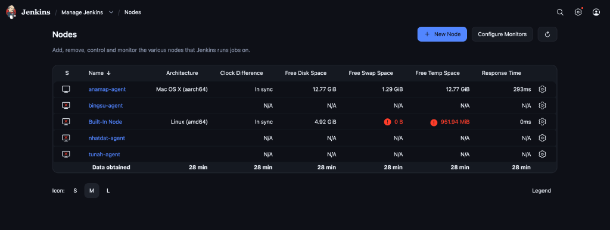

---

#### 7. Vấn Đề Gặp Phải Và Cách Giải Quyết

| Vấn đề                                                                                     | Nguyên nhân                                                                                               | Giải pháp                                                                                                                           |
| :----------------------------------------------------------------------------------------- | :-------------------------------------------------------------------------------------------------------- | :---------------------------------------------------------------------------------------------------------------------------------- |
| Pipeline chạy quá chậm do build lại toàn bộ Monorepo trên mỗi commit.                      | Jenkins mặc định thực thi toàn bộ project, dẫn đến build/test lại cả những service không có thay đổi.     | Triển khai logic `git diff --name-only` để phát hiện chính xác service có thay đổi và chỉ kích hoạt build/test cho module đó.       |
| Khó khăn trong việc quản lý và hiển thị báo cáo Test/Coverage cho hàng chục Microservices. | Việc chạy gộp khiến kết quả bị chồng chéo, khó xác định lỗi thuộc về service nào trong giao diện Jenkins. | Sử dụng các plugin `junit` và `jacoco` với đường dẫn động (`${service}/target/...`) để phân tách báo cáo chi tiết cho từng service. |
| Test service `search` bị lỗi `IllegalStateException` khi khởi chạy trên Jenkins.           | Sự khác biệt về cấu hình Kafka giữa môi trường Local và môi trường CI (Docker).                           | Bổ sung cấu hình `spring.kafka.listener.ack-mode=manual` vào file properties để khớp với logic xử lý tin nhắn trong code.           |

---

---

### 2. Branch Protection

#### 1. Cấu Hình Branch Protection Trên GitHub

##### 1.1 Các Rule Đã Cấu Hình

Cấu hình tại: `GitHub Repository > Settings > Branches > Add branch protection rule`

| Rule | Giá trị | Mục đích |
|------|:-------:|----------|
| Branch name pattern | `main` | Áp dụng cho nhánh chính |
| Require a pull request before merging | Bật | Bắt buộc tạo PR, cấm push trực tiếp |
| Required number of approvals | `2` | Cần ít nhất 2 thành viên approve |
| Require status checks to pass | Bật | Jenkins CI phải pass trước khi merge |
| Require branches to be up to date before merging | Bật | Branch phải được sync với `main` |
| Do not allow bypassing above settings | Bật | Admin cũng phải tuân thủ quy tắc |

##### 1.2 Hình Ảnh Minh Chứng

**Hình 1.1 — Cấu hình bắt buộc tạo Pull Request và số lượng Approval**


**Hình 1.2 — Cấu hình bắt buộc Status Checks (Jenkins CI) phải pass**


**Hình 1.3 — Cấu hình bắt buộc cập nhật nhánh trước khi merge**


**Hình 1.4 — Cấu hình không cho phép Admin lách luật**


**Hình 1.5 — Push trực tiếp vào nhánh `main` bị từ chối**

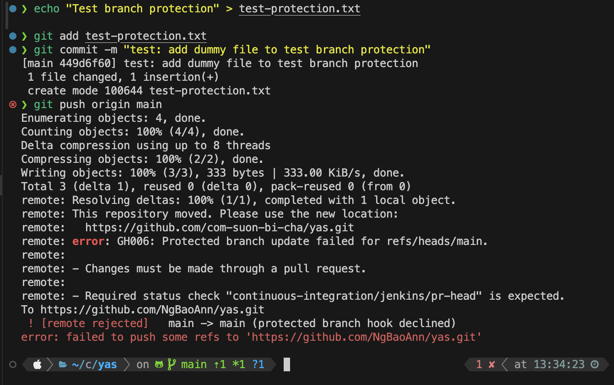

**Hình 1.6 — Pull Request hiển thị yêu cầu 2 lượt approve và CI check phải pass**


#### 5. Pull Request Demo (Trạng Thái Open)

Theo yêu cầu nộp bài, nhóm duy trì ít nhất một PR ở trạng thái Open trên GitHub.


**Hình 5.1 — Pull Request đang ở trạng thái Open, chờ review**

```
[HÌNH: Trang PR trên GitHub với nhãn "Open", hiển thị reviewer và CI status]
```

---

---

### 3. Security Scanning

#### 1. Tích Hợp Gitleaks — Quét Secret Bị Lộ

##### 1.1 Mô Tả

Gitleaks là công cụ quét mã nguồn để phát hiện các thông tin nhạy cảm bị commit nhầm vào repository, bao gồm API key, mật khẩu, token truy cập và các credential khác.

##### 1.2 Cấu Hình Stage Trong Jenkinsfile

```groovy
stage('Secret Scanning') {
    steps {
        sh '''
            gitleaks detect --source . \
                --config gitleaks.toml \
                --report-format json \
                --report-path gitleaks-report.json \
                --exit-code 1
        '''
    }
    post {
        always {
            archiveArtifacts artifacts: 'gitleaks-report.json',
                             allowEmptyArchive: true
        }
    }
}
```

> Pipeline sẽ dừng lại (FAIL) ngay tại stage này nếu Gitleaks phát hiện secret bị lộ.

##### 1.3 Xử Lý False Positive

Sau lần chạy đầu tiên, Gitleaks phát hiện **13 findings** trong lịch sử commit — tất cả đều là Keycloak client secret từ **upstream repository** (nashtech-garage/yas), không phải secret thật của nhóm. Các giá trị này là credential cố định dùng cho môi trường dev/demo.

Xử lý bằng cách thêm `commits` vào `allowlist` trong `gitleaks.toml`:

```toml
[allowlist]
description = "global allow list"
paths = [
  '''test-realm.json''',
  '''realm-export''',
  '''keycloak-yas-realm-import.yaml''',
  '''target'''
]
# False positives from upstream YAS repository (dev/demo Keycloak credentials, not real secrets)
commits = [
  "af2c9421030761ec4eccb0994a6c576592be113b",
  "8dc5e08456e8fa8c970b7b0cadcffdcd15d77e39",
  "f3d6c4a83259ca06fc9bc1889b9369d11b423256",
  "2192b03da8ca22e188ecf17f693fb9fbe9376811",
  "b2294a232aa1eea10b9814cf6ece03c5871b98d7",
  "e8fb3139974eb1a27b224416742c6902300ffee3",
  "0cac9558db4e4aa004d72e47e652384d6f32a666",
  "14f0528e9d235c13db92db3bf5e9f3b1cf5b1a7e"
]
```

Sử dụng `commits` allowlist thay vì `paths` để đảm bảo chính xác — chỉ bỏ qua đúng các commit từ upstream, không bỏ qua các secret thật có thể xuất hiện trong tương lai tại cùng file đó.

##### 1.4 Hình Ảnh Minh Chứng

**Hình 1.1 — Stage Secret Scanning chạy thành công (không phát hiện secret)**

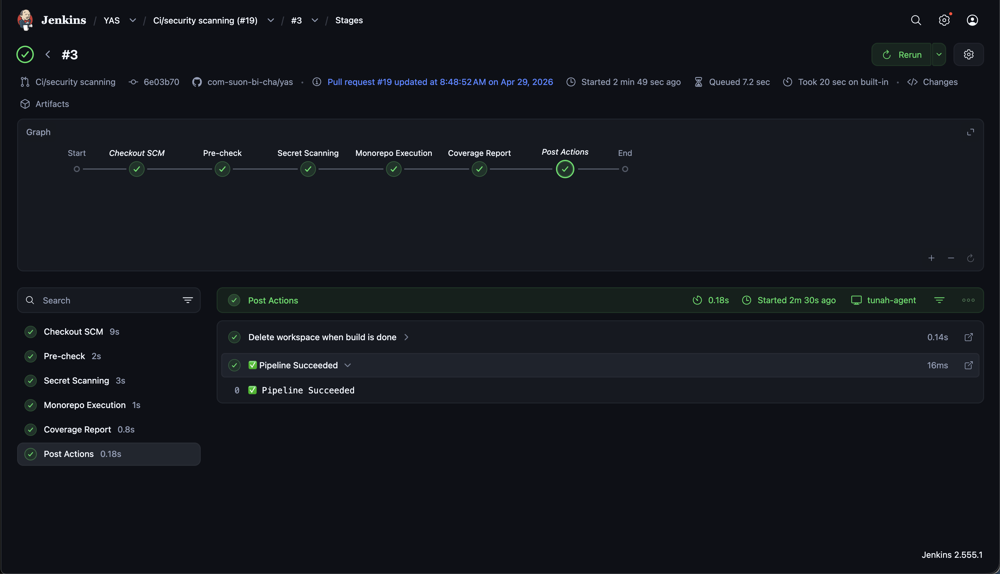

**Hình 1.2 — Pipeline thất bại khi Gitleaks phát hiện secret**


---

#### 2. Tích Hợp SonarQube — Phân Tích Chất Lượng Code

##### 2.1 Cài Đặt SonarQube Server

| Thông số | Giá trị |
|----------|---------|
| Phương thức triển khai | Docker (deploy trên Jenkins server) |
| Phiên bản SonarQube | `v26.4.0.121862` (Community Build) |
| Địa chỉ truy cập | `http://18.140.115.86:9000` |
| Project Key | `yas` |

##### 2.2 Kết Nối Jenkins Với SonarQube

Các bước cấu hình:
1. Cài plugin **SonarQube Scanner** trên Jenkins: `Manage Jenkins > Plugins > Available plugins`
2. Tạo token trên SonarQube: `My Account > Security > Generate Tokens` → tên `jenkins-token`
3. Lưu token vào Jenkins Credentials: `Manage Jenkins > Credentials > Global > Add Credentials`
   - Kind: `Secret text`, ID: `sonarqube-token`
4. Thêm SonarQube server: `Manage Jenkins > System > SonarQube servers`
   - Name: `SonarQube`
   - Server URL: `http://18.140.115.86:9000`
   - Token: chọn `sonarqube-token`
5. Tạo webhook từ SonarQube về Jenkins: `Administration > Configuration > Webhooks`
   - Name: `jenkins`, URL: `${JENKINS_URL}/sonarqube-webhook/` (ví dụ: `https://jenkins.example.com/sonarqube-webhook/`)

##### 2.3 Cấu Hình Stage Trong Jenkinsfile

```groovy
stage('Code Quality') {
    steps {
        withSonarQubeEnv('SonarQube') {
            sh 'mvn sonar:sonar -Dsonar.projectKey=yas -Dsonar.java.binaries=.'
        }
    }
}
stage('Quality Gate') {
    steps {
        timeout(time: 5, unit: 'MINUTES') {
            waitForQualityGate abortPipeline: true
        }
    }
}
```

> `-Dsonar.java.binaries=.` chỉ định nơi SonarQube tìm **bytecode `.class` đã được compile sẵn`** trong workspace; tham số này **không tự build/compile thêm**. Với monorepo mà pipeline chỉ build một số module, cần bảo đảm các module Java cần phân tích đã được compile trước khi chạy `sonar:sonar`, hoặc giới hạn phạm vi phân tích vào đúng các module đã build.

##### 2.4 Kết Quả Phân Tích

SonarQube phân tích toàn bộ monorepo `yas` với **21k Lines of Code** (Java, XML). Kết quả Quality Gate: **Passed**.

| Chỉ số | Kết quả |
|--------|---------|
| Security | 0 issues |
| Reliability | 45 issues |
| Maintainability | 152 issues |
| Coverage | 0.0% |
| Duplications | 3.5% |

> **Lưu ý:** Coverage hiển thị 0.0% trên SonarQube vì pipeline chưa cấu hình `sonar.coverage.jacoco.xmlReportPaths` để đẩy báo cáo JaCoCo lên SonarQube. Độ phủ test thực tế được đo và enforce bằng JaCoCo plugin trực tiếp trên Jenkins (xem phần Coverage Gate).

##### 2.5 Hình Ảnh Minh Chứng

**Hình 2.1 — SonarQube Dashboard: project `yas` với Quality Gate Passed**

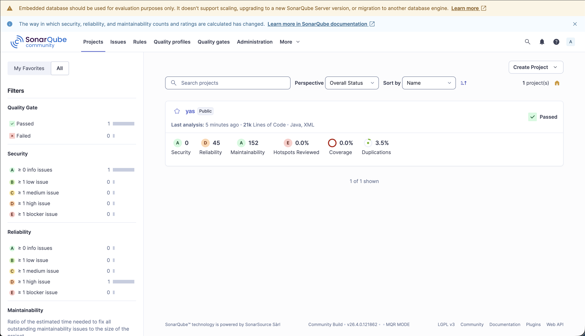

**Hình 2.2 — Jenkins pipeline: stage Code Quality (29s) và Quality Gate (23s) chạy thành công**

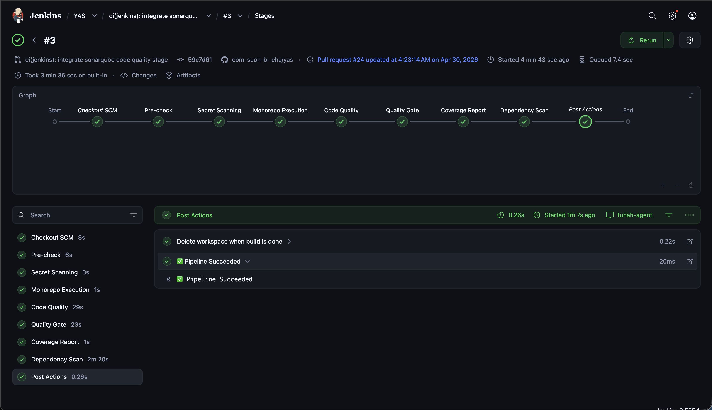

**Hình 2.3 — Jenkins build summary: pipeline hoàn thành thành công**


---

#### 3. Tích Hợp Snyk — Quét Lỗ Hổng Dependency

##### 3.1 Cài Đặt Và Cấu Hình

| Thông số | Giá trị |
|----------|---------|
| Tài khoản Snyk | `https://app.snyk.io` |
| Phương thức xác thực | API Token (lưu trong Jenkins Credentials với ID `snyk-token`) |
| Phương thức tích hợp | Snyk CLI (`snyk test` + `snyk monitor`) |

Các bước cấu hình:
1. Đăng ký tài khoản tại `https://app.snyk.io`
2. Vào `Account Settings > Auth Token` → copy token
3. Thêm vào Jenkins: `Manage Jenkins > Credentials > Global > Add Credentials` (Kind: `Secret text`, ID: `snyk-token`)
4. Cài Snyk CLI trên Jenkins agent: `npm install -g snyk`

##### 3.2 Cấu Hình Stage Trong Jenkinsfile

```groovy
stage('Dependency Scan') {
    steps {
        withCredentials([string(credentialsId: 'snyk-token', variable: 'SNYK_TOKEN')]) {
            sh 'snyk auth $SNYK_TOKEN'
            sh 'snyk test --all-projects --json > snyk-report.json || true'
            sh 'snyk monitor --all-projects || true'
        }
    }
    post {
        always {
            archiveArtifacts artifacts: 'snyk-report.json',
                             allowEmptyArchive: true
        }
    }
}
```

> `snyk test` quét và báo cáo vulnerability ra console/file. `snyk monitor` đẩy kết quả lên Snyk dashboard để theo dõi liên tục. Cả hai dùng `|| true` để pipeline không FAIL khi phát hiện vulnerability mức thấp.

##### 3.3 Kết Quả Quét

Snyk phát hiện vulnerability trong toàn bộ monorepo `com-suon-bi-cha/yas` với tổng cộng **55 Critical, 179 High, 140 Medium, 71 Low** trên tất cả các module. Đây là các lỗ hổng trong dependency (thư viện bên thứ ba) mà các service đang sử dụng.

##### 3.4 Hình Ảnh Minh Chứng

**Hình 3.1 — Snyk Dashboard: danh sách project và vulnerability được phát hiện**


**Hình 3.2 — Stage Dependency Scan trong Jenkins pipeline chạy thành công**


---

#### 4. Tổng Hợp Pipeline Sau Khi Tích Hợp Security Stages

Pipeline hoàn chỉnh bao gồm các stage theo thứ tự:

```
Pre-check → Secret Scanning → Monorepo Execution → Code Quality → Quality Gate → Coverage Report → Dependency Scan
```

**Hình 4.1 — Toàn bộ pipeline chạy thành công với stage Dependency Scan**


---

#### 5. Vấn Đề Gặp Phải Và Cách Giải Quyết

| Vấn đề | Nguyên nhân | Giải pháp |
|--------|-------------|-----------|
| `gitleaks: command not found` tại Pre-check | Gitleaks chưa được cài trên Jenkins agent | Cài `brew install gitleaks` trên agent |
| Gitleaks phát hiện 13 findings, pipeline FAIL | Keycloak client secret từ upstream repo bị nhận nhầm là secret thật | Thêm `commits` allowlist vào `gitleaks.toml` cho 8 commit từ upstream |
| Snyk chạy xong nhưng không thấy project trên dashboard | `snyk test` chỉ quét local, không đẩy lên dashboard | Thêm `snyk monitor` vào stage để đăng ký project lên Snyk dashboard |

---

---

### 4. Coverage Gate

#### 1. Cấu Hình JaCoCo Coverage Gate

##### 1.1 Mô Tả

JaCoCo (Java Code Coverage) đo lường độ phủ của unit test trên mã nguồn. Coverage Gate là cơ chế tự động làm thất bại pipeline khi độ phủ thấp hơn ngưỡng quy định. Nhóm đặt ngưỡng là **70% instruction coverage**.

##### 1.2 Cấu Hình Trong `pom.xml`

Thêm cấu hình `check` goal vào JaCoCo plugin để pipeline tự động fail khi coverage không đạt:

```xml
<plugin>
    <groupId>org.jacoco</groupId>
    <artifactId>jacoco-maven-plugin</artifactId>
    <executions>
        <execution>
            <id>prepare-agent</id>
            <goals><goal>prepare-agent</goal></goals>
        </execution>
        <execution>
            <id>report</id>
            <goals><goal>report</goal></goals>
        </execution>
        <execution>
            <id>check</id>
            <goals><goal>check</goal></goals>
            <configuration>
                <rules>
                    <rule>
                        <element>BUNDLE</element>
                        <limits>
                            <limit>
                                <counter>INSTRUCTION</counter>
                                <value>COVEREDRATIO</value>
                                <minimum>0.70</minimum>
                            </limit>
                        </limits>
                    </rule>
                </rules>
            </configuration>
        </execution>
    </executions>
</plugin>
```

> Khi coverage < 70%, lệnh `mvn verify` hoặc `mvn jacoco:check` sẽ trả về BUILD FAILURE.

##### 1.3 Cấu Hình Stage Trong Jenkinsfile

```groovy
stage('Coverage Report') {
    steps {
        sh './mvnw -f ../pom.xml test jacoco:report -pl <service> -am'
    }
    post {
        always {
            jacoco(
                execPattern: '**/target/jacoco.exec',
                classPattern: '**/target/classes',
                sourcePattern: '**/src/main/java',
                minimumInstructionCoverage: '70',
                changeBuildStatus: true
            )
        }
    }
}
```

> Tham số `changeBuildStatus: true` cho phép plugin JaCoCo trên Jenkins tự động đổi trạng thái build sang FAILURE nếu coverage không đạt ngưỡng.

##### 1.4 Hình Ảnh Minh Chứng

**Hình 1.1 — Cấu hình JaCoCo Coverage Gate trong file pom.xml**

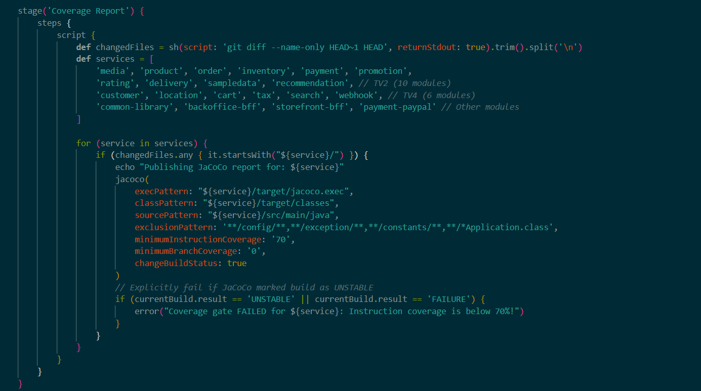

**Hình 1.2 — Pipeline thất bại khi coverage dưới ngưỡng 70% (trường hợp demo)**

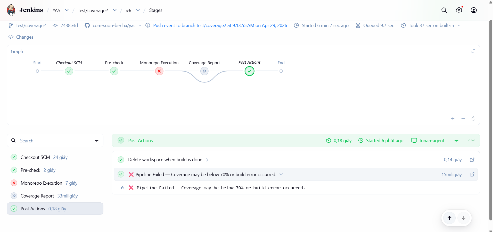

**Hình 1.3 — Pipeline thành công sau khi bổ sung đủ unit test**

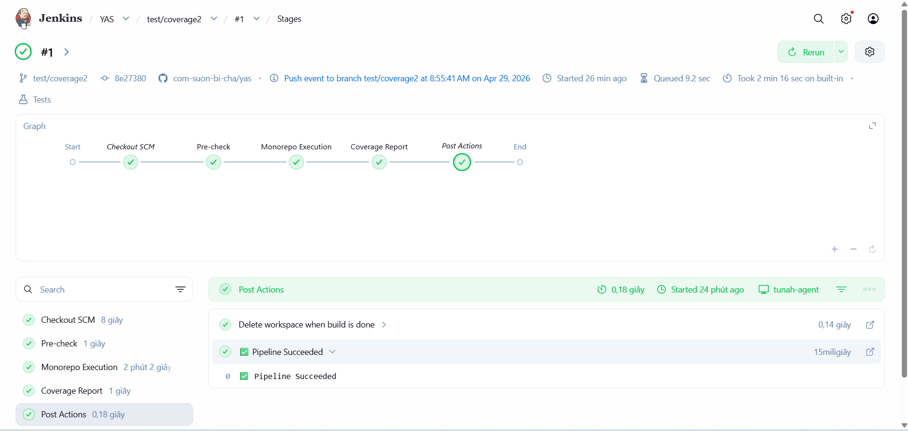

**Hình 1.4 — Báo cáo JaCoCo Coverage hiển thị trong giao diện Jenkins**

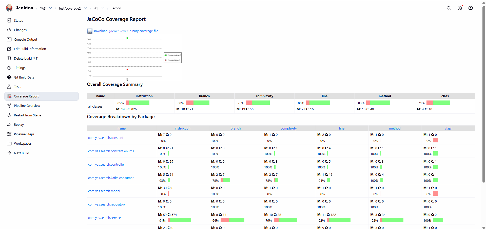


---

## VI. Unit Test — Chi Tiết Từng Module

### Hướng Dẫn Chung Chạy Test

Do project sử dụng cấu trúc monorepo với thuộc tính `${revision}`, lệnh phải chạy từ bên trong thư mục module tương ứng:

```bash
cd /duong-dan/yas/<module>
./mvnw -f ../pom.xml test -pl <module> -am
./mvnw -f ../pom.xml test jacoco:report -pl <module> -am
open target/site/jacoco/index.html
```


##### 2.2 Module `media`

- **Branch:** `test/media`
- **Pull Request:** `[Link PR]`

**Danh Sách File Test:**
| File Test | Lớp được kiểm thử | Số test case |
|-----------|-------------------|:------------:|
| `MediaControllerTest.java` | `MediaController` — tất cả 5 endpoints | 8 |
| `MediaServiceUnitTest.java` | `MediaService` — logic nghiệp vụ | 13 |
| `FileSystemRepositoryTest.java` | `FileSystemRepository` — thao tác lưu/đọc file | 4 |
| `StringUtilsTest.java` | `StringUtils` — xác thực chuỗi văn bản | 11 |
| `FileTypeValidatorTest.java` | `FileTypeValidator` — xác thực loại và nội dung file ảnh | 6 |
| **Tổng** | | **42** |

**Lưu Ý Kỹ Thuật:**
Annotation `@WebMvcTest` cần loại trừ `OAuth2ResourceServerAutoConfiguration` để tránh lỗi load ApplicationContext trong môi trường test không có server OAuth2:
```java
@WebMvcTest(controllers = MediaController.class,
    excludeAutoConfiguration = OAuth2ResourceServerAutoConfiguration.class)
@AutoConfigureMockMvc(addFilters = false)
class MediaControllerTest { ... }
```

**Kết Quả Coverage:** 
| Package | Coverage (Instructions) | Coverage (Branches) |
|---------|:-----------------------:|:-------------------:|
| `com.yas.media.controller` | 100% | 100% |
| `com.yas.media.service` | 89% | 90% |
| `com.yas.media.utils` | 92% | 100% |
| `com.yas.media.viewmodel` | 86% | n/a |
| `com.yas.media.repository` | 73% | 62% |
| `com.yas.media.model` | 100% | n/a |
| `com.yas.media.mapper` | 38% | 7% |
| **Tổng** | **80%** | **65%** |

*(Đạt yêu cầu tối thiểu >= 70%)*

**Hình Ảnh Minh Chứng:**
- **Báo cáo JaCoCo Coverage cho service media (tổng 80%):**


##### 2.3 Module `product`

- **Branch:** `test/product`
- **Pull Request:** `https://github.com/com-suon-bi-cha/yas/pull/<so>`

**Danh Sách File Test:**
| File Test | Lớp được kiểm thử | Số test case |
|-----------|-------------------|:------------:|
| (Có sẵn và bổ sung) `ProductService*Test.java` (được tách thành 10 file nhỏ) | `ProductService` | Nhiều test case |
| (Có sẵn và bổ sung) `CategoryServiceTest.java` | `CategoryService` | Nhiều test case |
| (Bổ sung) `MediaServiceTest.java` | `MediaService` trong product | ~4 |
| (Bổ sung) `ProductConverterTest.java` | `ProductConverter` | Nhiều test case |
| **Tổng** | Các file trong `src/test/java` | **178** |

**Kết Quả Coverage:** 
| Package | Coverage (Instructions) | Coverage (Branches) |
|---------|:-----------------------:|:-------------------:|
| `com.yas.product.controller` | 87% | 58% |
| `com.yas.product.service` | 64% | 46% |
| `com.yas.product.validation` | 93% | 50% |
| **Tổng** | **71%** | **47%** |

*(Đạt yêu cầu tối thiểu >= 70%)*

**Hình Ảnh Minh Chứng:**
- **Kết quả chạy test service product: BUILD SUCCESS**

```
[INFO] Tests run: 178, Failures: 0, Errors: 0, Skipped: 0
[INFO] BUILD SUCCESS
```

- **Báo cáo JaCoCo Coverage cho service product (tổng 71%)**


##### 2.4 Module `order`

- **Branch:** `test/order`
- **Pull Request:** `https://github.com/com-suon-bi-cha/yas/pull/<so>`

**Danh Sách File Test:**
| File Test | Lớp/Phương thức được kiểm thử | Số test case |
|-----------|-------------------------------|:------------:|
| `OrderServiceCreateTest.java` | `createOrder` | 1 |
| `OrderServiceGetTest.java` | `getOrderWithItemsById`, `getAllOrder`, `getLatestOrders`, `getMyOrders`, `findOrderVmByCheckoutId`, `findOrderByCheckoutId` | 11 |
| `OrderServiceStatusTest.java` | `updateOrderPaymentStatus`, `rejectOrder`, `acceptOrder` | 7 |
| `OrderServiceOtherTest.java` | `isOrderCompletedWithUserIdAndProductId`, `exportCsv` | 4 |
| `CheckoutServiceTest.java` | `CheckoutService` | 8 |
| **Tổng** | | **31+** |

**Kết Quả Coverage:** 
| Package | Coverage (Instructions) | Coverage (Branches) |
|---------|:-----------------------:|:-------------------:|
| `com.yas.order.service` | 77% | 75% |
| `com.yas.order.specification` | 43% | 34% |
| `com.yas.order.mapper` | 76% | 44% |
| **Tổng Module** | **76%** | **47%** |

*(Đạt yêu cầu tối thiểu >= 70%)*

**Hình Ảnh Minh Chứng:**
- **Báo cáo JaCoCo Coverage tổng quan module order (76%)**


##### 2.5 Module `inventory`

- **Branch:** `test/inventory`
- **Pull Request:** `[Link PR]`

**Danh Sách File Test:**
| File Test | Lớp được kiểm thử | Số test case |
|-----------|-------------------|:------------:|
| `WarehouseServiceTest.java` | `WarehouseService` | 9 |
| `StockServiceTest.java` | `StockService` | 6 |
| `StockHistoryServiceTest.java` | `StockHistoryService` | 2 |
| `LocationServiceTest.java` | `LocationService` (Có sẵn) | 4 |
| `ProductServiceTest.java` | `ProductService` (Có sẵn) | 3 |
| **Tổng** | | **24+** |

**Kết Quả Coverage:** 
| Package | Coverage (Instructions) | Coverage (Branches) |
|---------|:-----------------------:|:-------------------:|
| `com.yas.inventory.service` | 84% | 66% |
| **Tổng Module** | **89%** | **70%** |

*(Đạt yêu cầu tối thiểu >= 70%)*

**Hình Ảnh Minh Chứng:**
- **Báo cáo JaCoCo Coverage tổng quan module inventory (89%)**

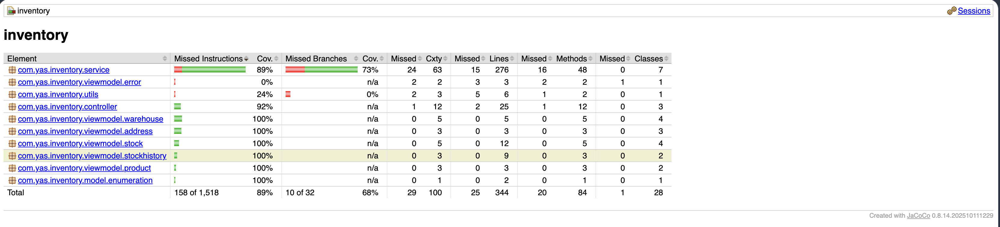

##### 2.6 Module `payment`

- **Branch:** `test/payment`
- **Pull Request:** `https://github.com/com-suon-bi-cha/yas/pull/<so>`

**Danh Sách File Test:**
| File Test | Lớp được kiểm thử | Số test case |
|-----------|-------------------|:------------:|
| `PaymentControllerTest.java` | `PaymentController` | 3 |
| `PaymentProviderControllerTest.java` | `PaymentProviderController` | 3 |
| `PaymentProviderServiceTest.java` | `PaymentProviderService` | 7 |
| `OrderServiceTest.java` | `OrderService` | 2 |
| `PaypalHandlerTest.java` | `PaypalHandler`, `AbstractPaymentHandler` | 3 |
| `PaymentServiceTest.java` | `PaymentService` | 2 |
| `MediaServiceTest.java` | `MediaService` | 2 |
| **Tổng** | | **22** |

**Kết Quả Coverage:** 
| Package | Coverage (Instructions) |
|---------|:-----------------------:|
| `controller` | 100.00% |
| `service` | 89.08% |
| `service.provider.handler` | 100.00% |
| `mapper` | 46.01% |
| `viewmodel` | 77.78% |
| `viewmodel.paymentprovider` | 100.00% |
| `model.enumeration` | 100.00% |
| **Tổng** | **72.33%** |

*(Đạt yêu cầu tối thiểu >= 70%)*

**Hình Ảnh Minh Chứng:**
- **Báo cáo JaCoCo Coverage cho service payment đạt 72.33%**


##### 2.7 Module `promotion`

- **Branch:** `test/promotion`
- **Pull Request:** `https://github.com/com-suon-bi-cha/yas/pull/<so>`

**Danh Sách File Test:**
| File Test | Lớp được kiểm thử | Số test case |
|-----------|-------------------|:------------:|
| `PromotionControllerTest.java` | `PromotionController` | 11 |
| `PromotionServiceTest.java` | `PromotionService` | 14 |
| `ProductServiceTest.java` | `ProductService` | 5 |
| `PromotionValidatorTest.java` | `PromotionValidator` | 8 |
| `ErrorVmTest.java` | `ErrorVm` | 2 |
| `PromotionPutVmTest.java` | `PromotionPutVm` | 3 |
| `PromotionUsageVmTest.java` | `PromotionUsageVm` | 1 |
| `PromotionVmTest.java` | `PromotionVm` | 1 |
| `AuthenticationUtilsTest.java`| `AuthenticationUtils` | 3 |
| `MessagesUtilsTest.java` | `MessagesUtils` | 2 |
| `ConstantsTest.java` | `Constants` | 1 |
| **Tổng** | | **51** |

**Kết Quả Coverage:** 
| Package | Coverage (Instructions) |
|---------|:-----------------------:|
| `validation` | 100.00% |
| `controller` | 89.06% |
| `model.enumeration` | 100.00% |
| `service` | 73.91% |
| `viewmodel` | 93.64% |
| `model` | 37.78% |
| `utils` | 88.06% |
| `viewmodel.error` | 100.00% |
| **Tổng** | **82.07%** |

*(Đạt yêu cầu tối thiểu >= 70%)*

**Hình Ảnh Minh Chứng:**
- **Báo cáo JaCoCo Coverage cho service promotion đạt 82.07%**

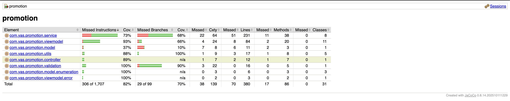

#### 4. Unit Test — Service `rating`

##### 4.1 Thông Tin Branch Và Pull Request

| Thông tin | Giá trị |
|-----------|---------|
| Tên branch | `test/rating` |
| Branch gốc | `main` |
| Link PR | `https://github.com/com-suon-bi-cha/yas/pull/<so>` |

##### 4.2 Danh Sách File Test

| File Test | Lớp được kiểm thử | Số test case |
|-----------|-------------------|:------------:|
| `RatingServiceTest.java` | `RatingService` | 14 |
| `OrderServiceTest.java` | `OrderService` | 2 |
| `AuthenticationUtilsTest.java` | `AuthenticationUtils` | 2 |
| `ConstantsTest.java` | `Constants` | 1 |
| `MessagesUtilsTest.java` | `MessagesUtils` | 2 |
| `RatingTest.java` | `Rating` (model) | 2 |
| **Tổng** | | **23** |

##### 4.3 Kết Quả Coverage (rating)

| Package | Coverage (Instructions) |
|---------|:-----------------------:|
| `model` | 100.00% |
| `controller` | 100.00% |
| `utils` | 73.77% |
| `service` | 83.66% |
| `viewmodel` | 83.33% |
| **Tổng** | **84.56%** |

Yêu cầu tối thiểu: >= 70% ✅

##### 4.4 Hình Ảnh Minh Chứng

**Hình 4.1 — Báo cáo JaCoCo Coverage cho service rating đạt 84.56%**


##### 2.9 Module `delivery`

- **Branch:** `test/delivery`
- **Pull Request:** `[Link PR]`

**Danh Sách File Test:**
| File Test | Lớp được kiểm thử | Số test case |
|-----------|-------------------|:------------:|
| `DeliveryApplicationTests.java` | `DeliveryApplication` | 1 |
| `DeliveryControllerTest.java` | `DeliveryController` | 1 |
| `DeliveryServiceTest.java` | `DeliveryService` | 1 |
| **Tổng** | | **3** |

**Kết Quả Coverage:** 100.00% (Instructions) | 0.00% (Branches - N/A)

**Hình Ảnh Minh Chứng:**

**Hình 2.1 — Báo cáo JaCoCo Coverage cho service delivery đạt 100%**


##### 2.10 Module `sampledata`

- **Branch:** `test/sampledata`
- **Pull Request:** `[Link PR]`

**Danh Sách File Test:**
| File Test | Lớp được kiểm thử | Số test case |
|-----------|-------------------|:------------:|
| `ErrorVmTest.java` | `ErrorVm` | 2 |
| `SampleDataVmTest.java` | `SampleDataVm` | 1 |
| `MessagesUtilsTest.java` | `MessagesUtils` | 1 |
| `SampleDataControllerTest.java` | `SampleDataController` | 1 |
| `SampleDataServiceTest.java` | `SampleDataService` | 1 |
| **Tổng** | | **6** |

**Kết Quả Coverage:** 81.37% (Instructions) | 0.00% (Branches - N/A)

**Hình Ảnh Minh Chứng:**

**Hình 2.2 — Báo cáo JaCoCo Coverage cho service sampledata đạt 81.37%**

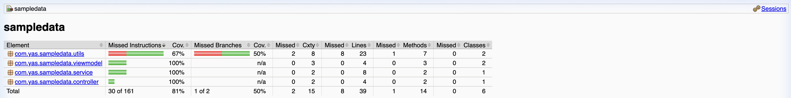

##### 2.11 Module `recommendation`

- **Branch:** `test/recommendation`
- **Pull Request:** `[Link PR]`

**Danh Sách File Test:**
| File Test | Lớp được kiểm thử | Số test case |
|-----------|-------------------|:------------:|
| `EmbeddingQueryControllerTest.java` | `EmbeddingQueryController` | 3 |
| `VectorQueryTest.java` | `VectorQuery` | 2 |
| `BaseVectorRepositoryTest.java` | `BaseVectorRepository` | 3 |
| `ProductVectorRepositoryTest.java` | `ProductVectorRepository` | 4 |
| `DefaultDocumentFormatterTest.java` | `DefaultDocumentFormatter` | 1 |
| **Tổng** | | **13** |

**Kết Quả Coverage:** 86.32% (Instructions) | 48.05% (Branches)

**Hình Ảnh Minh Chứng:**

**Hình 2.3 — Báo cáo JaCoCo Coverage cho service recommendation đạt 86.32%**


---


##### 2.2 Module `customer`

- **Branch:** `test/customer`
- **Pull Request:** `[Link PR]`

**Danh Sách File Test:**
| File Test | Lớp được kiểm thử | Số test case |
|-----------|-------------------|:------------:|
| `CustomerControllerTest.java` | `CustomerController` | 7 |
| `LocationControllerTest.java` | `LocationController` | 5 |
| `UserAddressControllerTest.java` | `UserAddressController` | 5 |
| `CustomerServiceTest.java` | `CustomerService` | 15 |
| `LocationServiceTest.java` | `LocationService` | 3 |
| `UserAddressServiceTest.java` | `UserAddressService` | 10 |
| `MessagesUtilsTest.java` | `MessagesUtils` | 2 |

**Kết Quả Coverage:** Instructions **87%** | Branches **87%**

**Hình Ảnh Minh Chứng:**

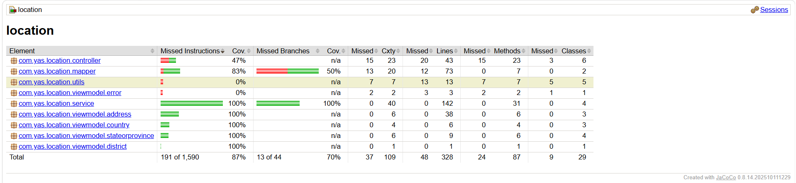

##### 2.3 Module `location`

- **Branch:** `test/location`
- **Pull Request:** `[Link PR]`

**Danh Sách File Test:**
| File Test | Lớp được kiểm thử | Số test case |
|-----------|-------------------|:------------:|
| `AddressControllerTest.java` | `AddressController` | 6 |
| `CountryControllerTest.java` | `CountryController` | 6 |
| `StateOrProvinceControllerTest.java` | `StateOrProvinceController` | 6 |
| `AddressServiceTest.java` | `AddressService` | 9 |
| `CountryServiceTest.java` | `CountryService` | 13 |
| `DistrictServiceTest.java` | `DistrictService` | 1 |
| `StateOrProvinceServiceTest.java` | `StateOrProvinceService` | 14 |

**Kết Quả Coverage:** Instructions **87%** | Branches **100%**

**Hình Ảnh Minh Chứng:**

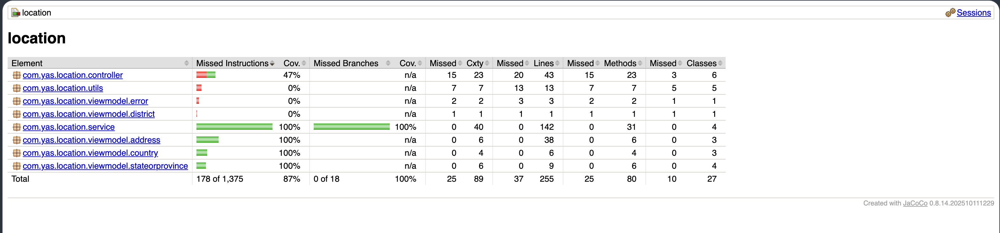

##### 2.4 Module `cart`

- **Branch:** `test/cart`
- **Pull Request:** `[Link PR]`

**Danh Sách File Test:**
| File Test | Lớp được kiểm thử | Số test case |
|-----------|-------------------|:------------:|
| `CartItemServiceTest.java` | `CartItemService` | 10 |
| `ProductServiceTest.java` | `ProductService` | 1 |
| `CartItemControllerTest.java` | `CartItemController` | 12 |

**Kết Quả Coverage:** Instructions **88%** | Branches **68%**

**Hình Ảnh Minh Chứng:**

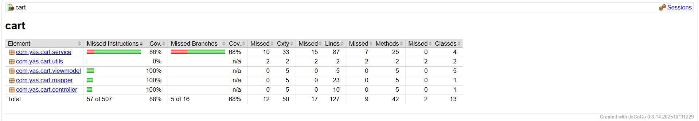

##### 2.5 Module `tax`

- **Branch:** `test/tax`
- **Pull Request:** `[Link PR]`

**Danh Sách File Test:**
| File Test | Lớp được kiểm thử | Số test case |
|-----------|-------------------|:------------:|
| `TaxClassServiceTest.java` | `TaxClassService` | 8 |
| `TaxRateServiceTest.java` | `TaxRateService` | 15 |
| `TaxClassControllerTest.java` | `TaxClassController` | 6 |
| `TaxRateControllerTest.java` | `TaxRateController` | 7 |

**Kết Quả Coverage:** Instructions **87%** | Branches **100%**

**Hình Ảnh Minh Chứng:**

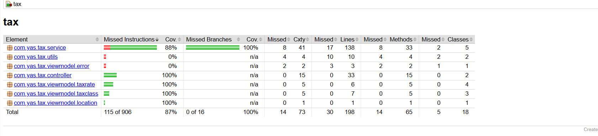

##### 2.6 Module `search`

- **Branch:** `test/search`
- **Pull Request:** `[Link PR]`

**Danh Sách File Test:**
| File Test | Lớp được kiểm thử | Số test case |
|-----------|-------------------|:------------:|
| `ProductServiceTest.java` | `ProductService` | 4 |
| `ProductSyncDataServiceTest.java` | `ProductSyncDataService` | 7 |
| `ProductControllerTest.java` | `ProductController` | 2 |
| `ProductSyncDataConsumerTest.java` | `ProductSyncDataConsumer` | 3 |

**Kết Quả Coverage:** Instructions **85%** | Branches **61%**

**Hình Ảnh Minh Chứng:**

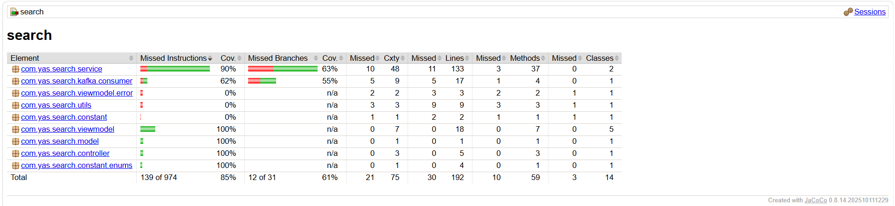

##### 2.7 Module `webhook`

- **Branch:** `test/webhook`
- **Pull Request:** `[Link PR]`

**Danh Sách File Test:**
| File Test | Lớp được kiểm thử | Số test case |
|-----------|-------------------|:------------:|
| `WebhookControllerTest.java` | `WebhookController` | 6 |
| `WebhookServiceTest.java` | `WebhookService` | 11 |
| `EventServiceTest.java` | `EventService` | 1 |
| `OrderEventServiceTest.java` | `OrderEventService` | 4 |
| `ProductEventServiceTest.java` | `ProductEventService` | 2 |
| `WebhookMapperTest.java` | `WebhookMapper` | 7 |

**Kết Quả Coverage:** Instructions **78%** | Branches **65%**

**Hình Ảnh Minh Chứng:**

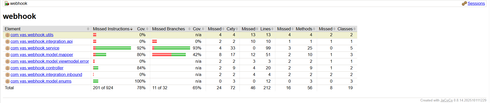

##### 2.8 Bảng Tổng Hợp Kết Quả Coverage (6 modules)

Yêu cầu tối thiểu: >= 70%

| Module | Coverage (Instructions) | Coverage (Branches) | Đạt >= 70% |
|--------|:-----------------------:|:-------------------:|:----------:|
| `customer` | 87% | 87% | ✅ |
| `location` | 87% | 100% | ✅ |
| `cart` | 88% | 68% | ✅ |
| `tax` | 87% | 100% | ✅ |
| `search` | 85% | 61% | ✅ |
| `webhook` | 78% | 65% | ✅ |

---

## VII. Tổng Hợp Kết Quả Coverage (Toàn Dự Án — 16 Modules)

Yêu cầu tối thiểu: >= 70% Instruction Coverage

| Service | Coverage (Instructions) | Coverage (Branches) | Đạt >= 70% |
|---------|:-----------------------:|:-------------------:|:----------:|
| media   | 80%                     | 65%                 | ✅          |
| product | 71%                     | 47%                 | ✅          |
| order   | 76%                     | 47%                 | ✅          |
| inventory| 89%                    | 70%                 | ✅          |
| payment | 72%                     | —                   | ✅          |
| promotion| 82%                    | —                   | ✅          |
| rating  | 85%                     | —                   | ✅          |
| delivery| 100%                    | N/A                 | ✅          |
| sampledata| 81%                   | N/A                 | ✅          |
| recommendation| 86%               | 48%                 | ✅          |
| customer| 87%                     | 87%                 | ✅          |
| location| 88%                     | 88%                 | ✅          |
| cart    | 88%                     | 68%                 | ✅          |
| tax     | 87%                     | 100%                | ✅          |
| search  | 85%                     | 61%                 | ✅          |
| webhook | 78%                     | 65%                 | ✅          |

**Tất cả 16 module đều đạt yêu cầu tối thiểu >= 70% Instruction Coverage.**

---

