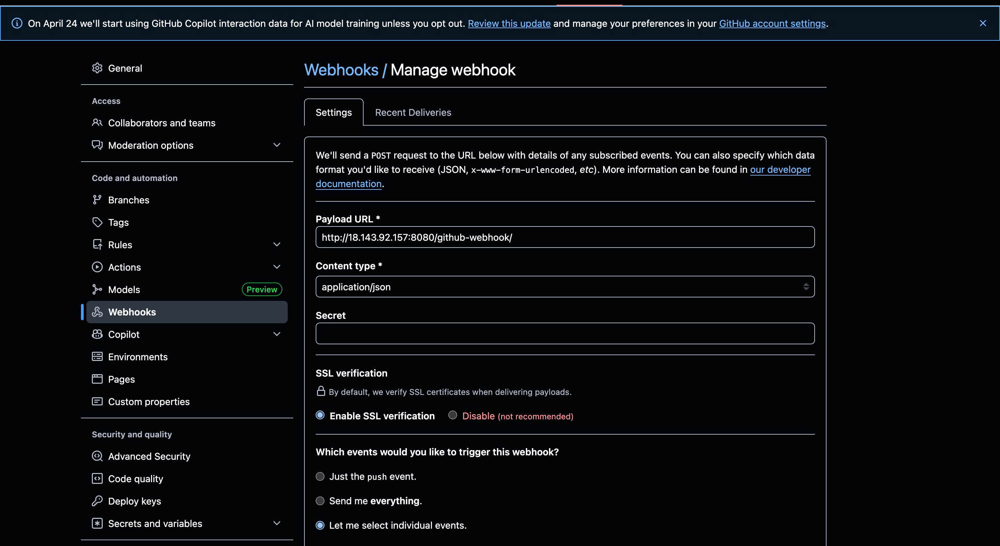
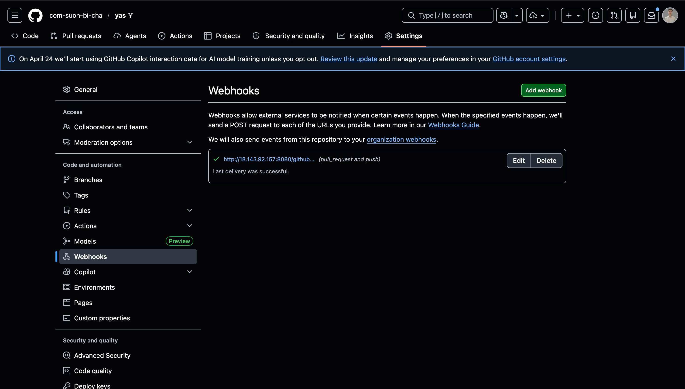
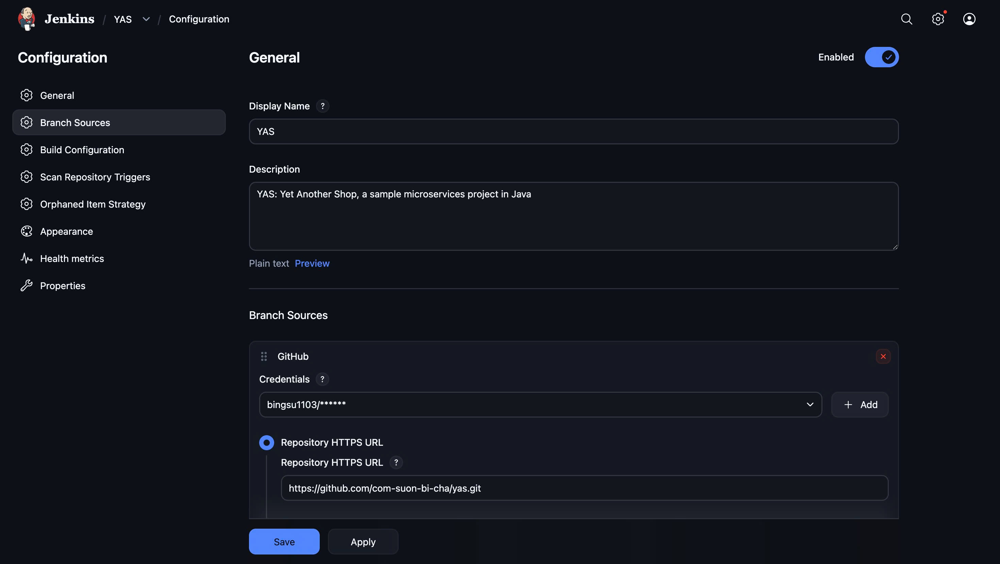
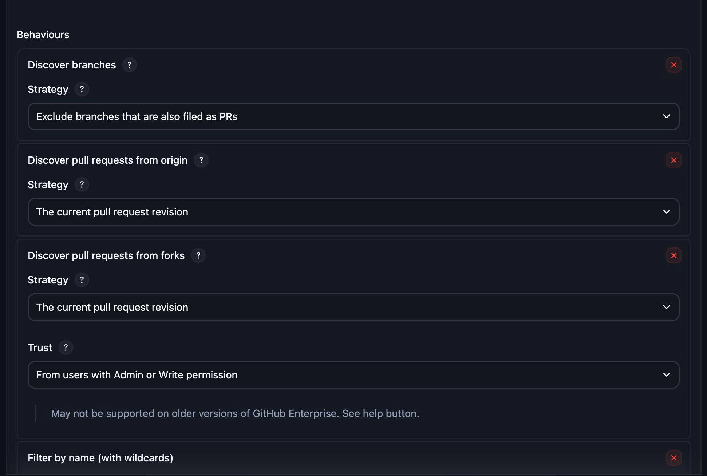
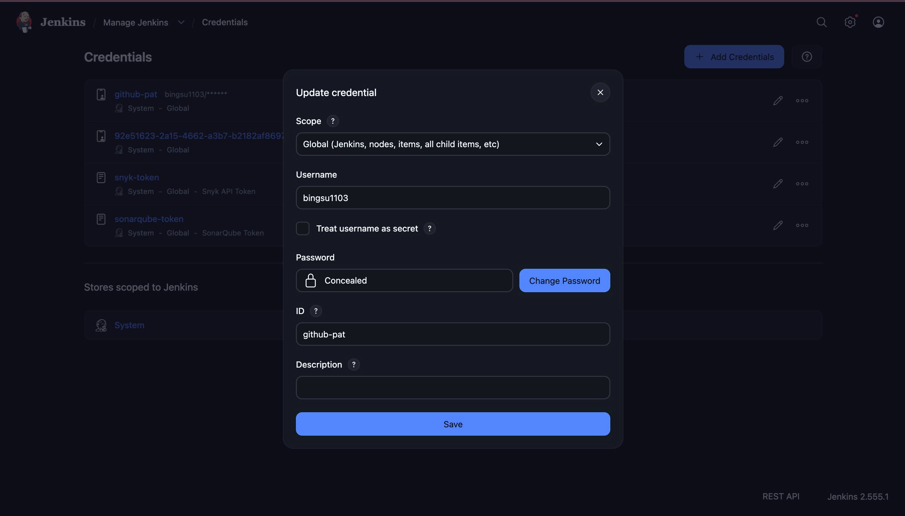
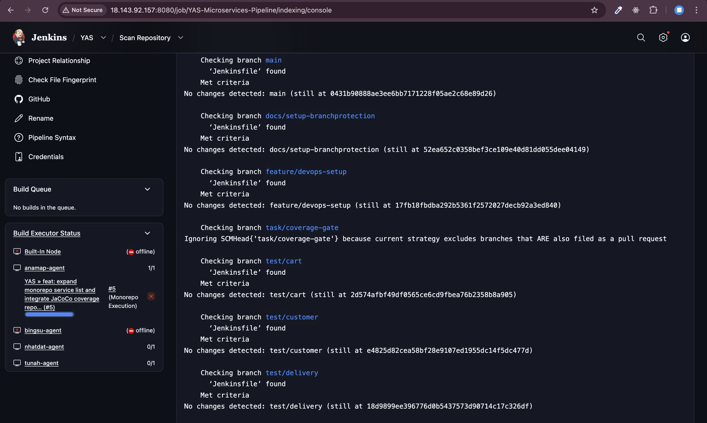
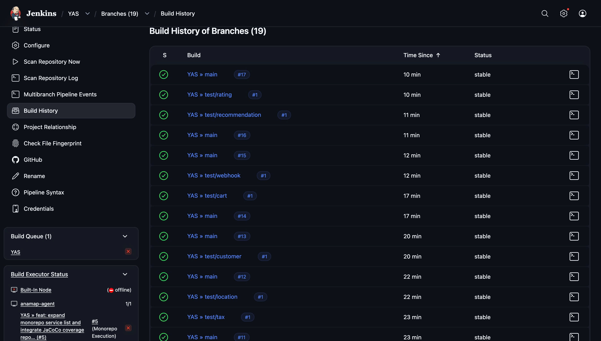
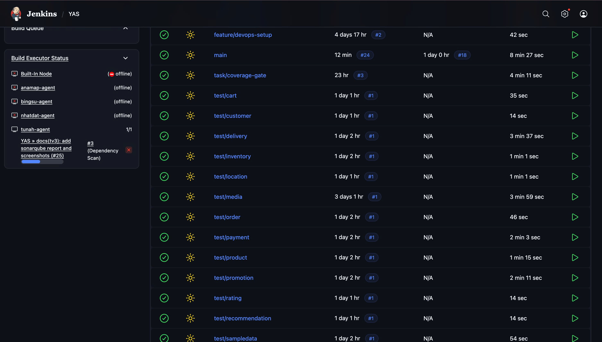
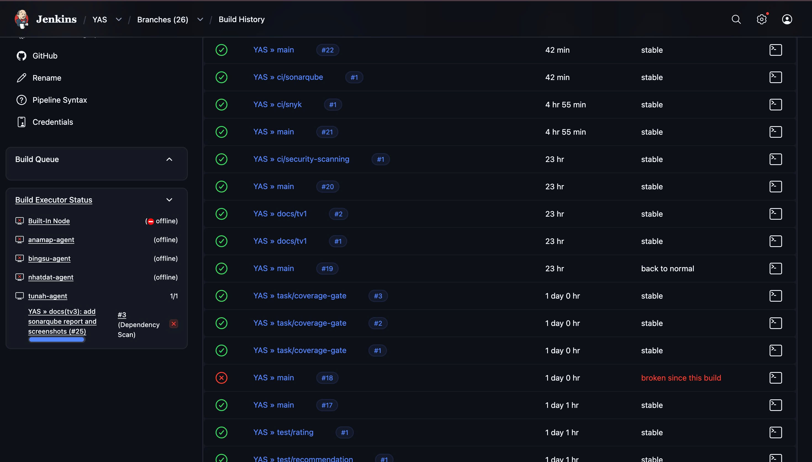

# Phần 1: Jenkins Infrastructure và Pipeline

**Người thực hiện:** [Họ và tên] — MSSV: `XXXXXXXX`  
**Phạm vi:** Cài đặt Jenkins Server, cấu hình GitHub Webhook, thiết lập Multibranch Pipeline, viết Jenkinsfile tích hợp logic Monorepo.

---

## 1. Cài Đặt Jenkins Server

### 1.1 Môi Trường Triển Khai

| Thông số               | Giá trị                                                                     |
| ---------------------- | --------------------------------------------------------------------------- |
| Phương thức triển khai | Virtual Machine Amazon EC2                                                  |
| Phiên bản Jenkins      | `2.555.1`                                                                   |
| Hệ điều hành           | Amazon Linux 2023 (kernel 6.1 AMI, architecture: arm64, instance: t3.small) |
| Phiên bản Java         | Amazon Corretto 21 (OpenJDK 21.0.10 LTS)                                    |

### 1.2 Plugin Đã Cài Đặt

| Plugin                    | Mục đích                                   |
| ------------------------- | ------------------------------------------ |
| Git Plugin                | Kết nối với GitHub repository              |
| Pipeline                  | Chạy Jenkinsfile dạng Declarative/Scripted |
| Multibranch Pipeline      | Tự động quét và build nhiều branch         |
| JaCoCo Plugin             | Publish báo cáo độ phủ unit test           |
| Warnings Next Generation  | Hiển thị kết quả phân tích tĩnh            |
| GitHub Integration Plugin | Nhận sự kiện từ GitHub Webhook             |

- Ngoài ra còn một số plugin được jenkins recommend khi setup lần đầu tiên.

### 1.3 Hình Ảnh Minh Chứng

**Hình 1.1 — Jenkins Dashboard sau khi cài đặt thành công**


## 2. Cấu Hình GitHub Webhook

### 2.1 Thiết Lập Webhook

Webhook được tạo tại: `Repository > Settings > Webhooks > Add webhook`

| Cấu hình       | Giá trị                                     |
| -------------- | ------------------------------------------- |
| Payload URL    | `http://18.143.92.157:8080/github-webhook/` |
| Content type   | `application/json`                          |
| Trigger events | Push events, Pull request events            |
| Trạng thái     | Active                                      |

### 2.2 Hình Ảnh Minh Chứng

**Hình 2.1 — Cấu hình Webhook trên GitHub**



**Hình 2.2 — Cấu hình Webhook trên GitHub**


**Hình 2.3 — Webhook delivery thành công (ping event trả về HTTP 200)**



---

## 3. Thiết Lập Multibranch Pipeline

### 3.1 Cấu Hình Job

| Cấu hình              | Giá trị                                      |
| --------------------- | -------------------------------------------- |
| Tên job               | `YAS`                                        |
| Loại job              | Multibranch Pipeline                         |
| Branch Source         | GitHub                                       |
| URL Repository        | `https://github.com/com-suon-bi-cha/yas.git` |
| Scan interval         | 2 minute                                     |
| Đường dẫn Jenkinsfile | `Jenkinsfile` (tại root)                     |

### 3.2 Hình Ảnh Minh Chứng

**Hình 3.1 — Cấu hình Multibranch Pipeline Job**



**Hình 3.2 — Cấu hình Multibranch Pipeline Job**



**Hình 3.3 — Cấu hình PAT Multibranch Pipeline Job**



**Hình 3.4 — Multibranch Pipeline Job — danh sách branch được Jenkins phát hiện**



**Hình 3.5 — Pipeline tự động kích hoạt sau khi push code**



---

## 4. Nội Dung Jenkinsfile

### 4.1 Cấu Trúc Pipeline

Pipeline gồm các stage theo thứ tự:

```groovy
pipeline {
    stages {
        stage('Pre-check')          { ... } // Kiểm tra môi trường (Java, Maven, Gitleaks)
        stage('Secret Scanning')    { ... } // Quét lộ bí mật (Secret) bằng Gitleaks
        stage('Monorepo Execution') { ... } // Tự động phát hiện thay đổi và Build/Test service tương ứng
        stage('Code Quality')           { ... } // Kiểm tra chất lượng code (SonarQube)
        stage('Quality Gate')           { ... } // Kiểm tra chất lượng code (SonarQube)
        stage('Coverage Report')    { ... } // Tổng hợp báo cáo độ phủ code JaCoCo
    }
}


```

### 4.2 Logic Phát Hiện Thay Đổi (Monorepo Optimization)

Để pipeline chỉ build service có thay đổi, sử dụng `git diff` so sánh với commit trước:

```groovy
def changedServices = sh(
    script: "git diff --name-only HEAD~1 HEAD",
    returnStdout: true
).trim().split('\n')

```

## 5. Kiểm Tra Pipeline Hoạt Động

**Hình 5.1 — Tất cả stage pipeline chạy thành công**



**Hình 5.2 — Lịch sử build trên Jenkins**



---

## 6. Vấn Đề Gặp Phải Và Cách Giải Quyết

| Vấn đề                                                                                     | Nguyên nhân                                                                                               | Giải pháp                                                                                                                           |
| :----------------------------------------------------------------------------------------- | :-------------------------------------------------------------------------------------------------------- | :---------------------------------------------------------------------------------------------------------------------------------- |
| Pipeline chạy quá chậm do build lại toàn bộ Monorepo trên mỗi commit.                      | Jenkins mặc định thực thi toàn bộ project, dẫn đến build/test lại cả những service không có thay đổi.     | Triển khai logic `git diff --name-only` để phát hiện chính xác service có thay đổi và chỉ kích hoạt build/test cho module đó.       |
| Khó khăn trong việc quản lý và hiển thị báo cáo Test/Coverage cho hàng chục Microservices. | Việc chạy gộp khiến kết quả bị chồng chéo, khó xác định lỗi thuộc về service nào trong giao diện Jenkins. | Sử dụng các plugin `junit` và `jacoco` với đường dẫn động (`${service}/target/...`) để phân tách báo cáo chi tiết cho từng service. |
| Test service `search` bị lỗi `IllegalStateException` khi khởi chạy trên Jenkins.           | Sự khác biệt về cấu hình Kafka giữa môi trường Local và môi trường CI (Docker).                           | Bổ sung cấu hình `spring.kafka.listener.ack-mode=manual` vào file properties để khớp với logic xử lý tin nhắn trong code.           |

---

_Phần này do TV1 thực hiện và chịu trách nhiệm nội dung._
