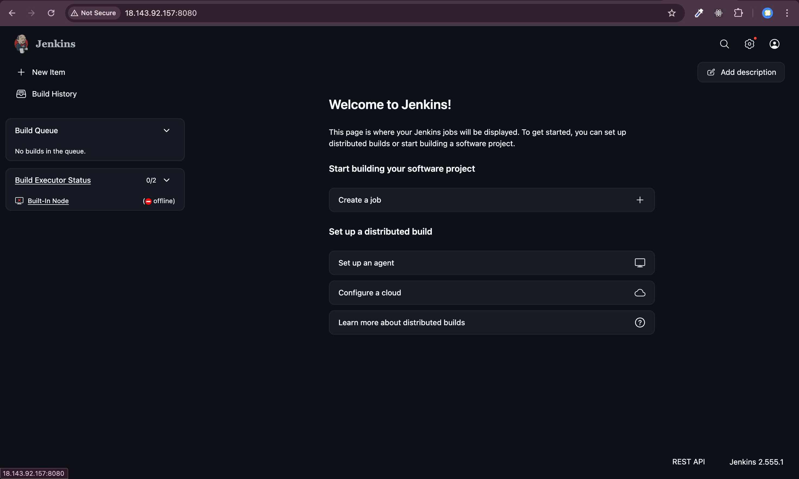
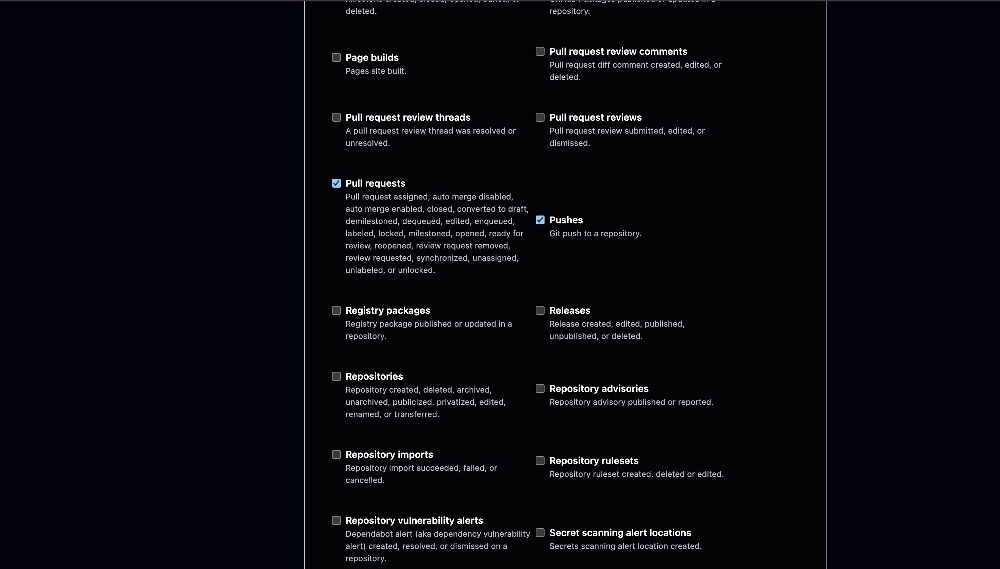

# Phần 1: Jenkins Infrastructure và Pipeline

**Người thực hiện:** [Họ và tên] — MSSV: `XXXXXXXX`  
**Phạm vi:** Cài đặt Jenkins Server, cấu hình GitHub Webhook, thiết lập Multibranch Pipeline, viết Jenkinsfile tích hợp logic Monorepo.

---

## 1. Cài Đặt Jenkins Server

### 1.1 Môi Trường Triển Khai

| Thông số               | Giá trị                                                                     |
| ---------------------- | --------------------------------------------------------------------------- |
| Phương thức triển khai | Virtual Machine Amazon EC2                                                  |
| Phiên bản Jenkins      | `2.555.1`                                                                   |
| Hệ điều hành           | Amazon Linux 2023 (kernel 6.1 AMI, architecture: arm64, instance: t3.small) |
| Phiên bản Java         | Amazon Corretto 21 (OpenJDK 21.0.10 LTS)                                    |

### 1.2 Plugin Đã Cài Đặt

| Plugin                    | Mục đích                                   |
| ------------------------- | ------------------------------------------ |
| Git Plugin                | Kết nối với GitHub repository              |
| Pipeline                  | Chạy Jenkinsfile dạng Declarative/Scripted |
| Multibranch Pipeline      | Tự động quét và build nhiều branch         |
| JaCoCo Plugin             | Publish báo cáo độ phủ unit test           |
| Warnings Next Generation  | Hiển thị kết quả phân tích tĩnh            |
| GitHub Integration Plugin | Nhận sự kiện từ GitHub Webhook             |

- Ngoài ra còn một số plugin được jenkins recommend khi setup lần đầu tiên.

### 1.3 Hình Ảnh Minh Chứng

**Hình 1.1 — Jenkins Dashboard sau khi cài đặt thành công**



## 2. Cấu Hình GitHub Webhook

### 2.1 Thiết Lập Webhook

Webhook được tạo tại: `Repository > Settings > Webhooks > Add webhook`

| Cấu hình       | Giá trị                                     |
| -------------- | ------------------------------------------- |
| Payload URL    | `http://18.143.92.157:8080/github-webhook/` |
| Content type   | `application/json`                          |
| Trigger events | Push events, Pull request events            |
| Trạng thái     | Active                                      |

### 2.2 Hình Ảnh Minh Chứng

**Hình 2.1 — Cấu hình Webhook trên GitHub**


**Hình 2.2 — Cấu hình Webhook trên GitHub**



**Hình 2.3 — Webhook delivery thành công (ping event trả về HTTP 200)**


---

## 3. Thiết Lập Multibranch Pipeline

### 3.1 Cấu Hình Job

| Cấu hình              | Giá trị                                      |
| --------------------- | -------------------------------------------- |
| Tên job               | `YAS`                                        |
| Loại job              | Multibranch Pipeline                         |
| Branch Source         | GitHub                                       |
| URL Repository        | `https://github.com/com-suon-bi-cha/yas.git` |
| Scan interval         | 2 minute                                     |
| Đường dẫn Jenkinsfile | `Jenkinsfile` (tại root)                     |

### 3.2 Hình Ảnh Minh Chứng

**Hình 3.1 — Multibranch Pipeline Job — danh sách branch được Jenkins phát hiện**

```
[HÌNH: Jenkins > yas-pipeline > danh sách branches đã quét]
```

**Hình 3.2 — Pipeline tự động kích hoạt sau khi push code**

```
[HÌNH: Build history hiển thị build mới sau khi push lên GitHub]
```

---

## 4. Nội Dung Jenkinsfile

### 4.1 Cấu Trúc Pipeline

Pipeline gồm các stage theo thứ tự:

```groovy
pipeline {
    agent any
    stages {
        stage('Detect Changes') { ... }   // Phát hiện service có thay đổi
        stage('Test')           { ... }   // Chạy mvn test + publish JUnit report
        stage('Coverage Report'){ ... }   // Publish JaCoCo report
        stage('Build')          { ... }   // Chạy mvn package -DskipTests
    }
}
```

### 4.2 Logic Phát Hiện Thay Đổi (Monorepo Optimization)

Để pipeline chỉ build service có thay đổi, sử dụng `git diff` so sánh với commit trước:

```groovy
def changedServices = sh(
    script: "git diff --name-only HEAD~1 HEAD | cut -d/ -f1 | sort -u",
    returnStdout: true
).trim().split('\n')

// Ví dụ: chỉ chạy test nếu thư mục 'media' thay đổi
if ('media' in changedServices) {
    sh 'cd media && ./mvnw -f ../pom.xml test -pl media -am'
}
```

### 4.3 Hình Ảnh Minh Chứng

**Hình 4.1 — Nội dung Jenkinsfile đầy đủ**

```
[HÌNH: Nội dung file Jenkinsfile tại root repository]
```

---

## 5. Kiểm Tra Pipeline Hoạt Động

**Hình 5.1 — Tất cả stage pipeline chạy thành công**

```
[HÌNH: Stage View hoặc Blue Ocean — tất cả stage màu xanh (SUCCESS)]
```

**Hình 5.2 — Minh chứng Monorepo: push vào thư mục `media/` chỉ kích hoạt build service media**

```
[HÌNH: Console output thể hiện chỉ module media được build/test]
```

**Hình 5.3 — Lịch sử build trên Jenkins**

```
[HÌNH: Danh sách các build theo thời gian, trạng thái SUCCESS/FAILURE]
```

---

## 6. Vấn Đề Gặp Phải Và Cách Giải Quyết

| Vấn đề     | Nguyên nhân | Giải pháp |
| ---------- | ----------- | --------- |
| [Điền vào] |             |           |

---

_Phần này do TV1 thực hiện và chịu trách nhiệm nội dung._
