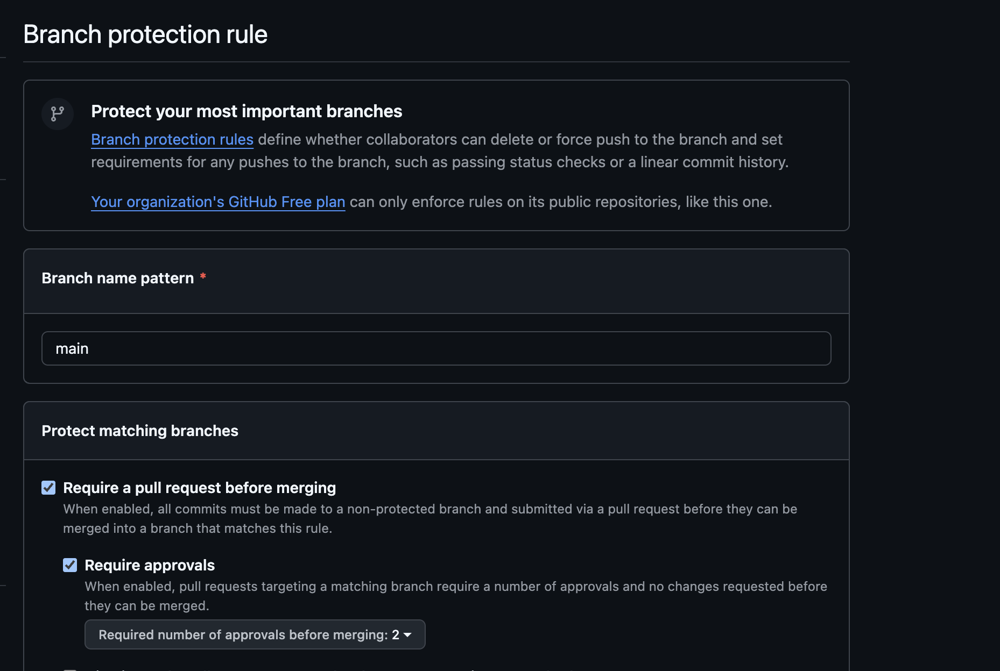
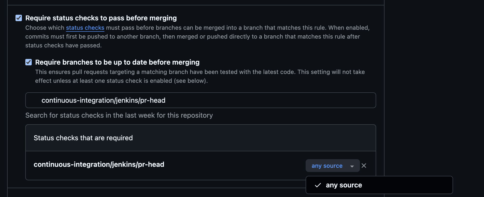
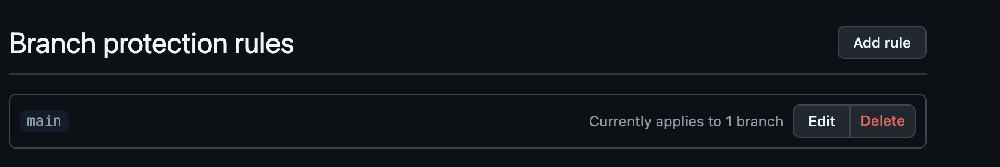
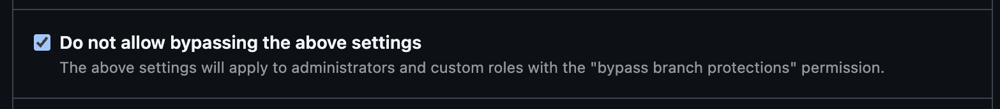
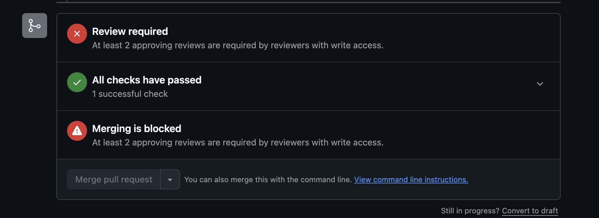

# Phần 2: Branch Protection và Unit Test (10 modules)

**Người thực hiện:** [Họ và tên] — MSSV: `XXXXXXXX`  
**Phạm vi:** Cấu hình Branch Protection trên GitHub, viết unit test cho 10 service module, tạo Pull Request demo.

---

## 1. Cấu Hình Branch Protection Trên GitHub

### 1.1 Các Rule Đã Cấu Hình

Cấu hình tại: `GitHub Repository > Settings > Branches > Add branch protection rule`

| Rule | Giá trị | Mục đích |
|------|:-------:|----------|
| Branch name pattern | `main` | Áp dụng cho nhánh chính |
| Require a pull request before merging | Bật | Bắt buộc tạo PR, cấm push trực tiếp |
| Required number of approvals | `2` | Cần ít nhất 2 thành viên approve |
| Require status checks to pass | Bật | Jenkins CI phải pass trước khi merge |
| Require branches to be up to date before merging | Bật | Branch phải được sync với `main` |
| Do not allow bypassing above settings | Bật | Admin cũng phải tuân thủ quy tắc |

### 1.2 Hình Ảnh Minh Chứng

**Hình 1.1 — Cấu hình bắt buộc tạo Pull Request và số lượng Approval**



**Hình 1.2 — Cấu hình bắt buộc Status Checks (Jenkins CI) phải pass**



**Hình 1.3 — Cấu hình bắt buộc cập nhật nhánh trước khi merge**



**Hình 1.4 — Cấu hình không cho phép Admin lách luật**



**Hình 1.5 — Push trực tiếp vào nhánh `main` bị từ chối**


**Hình 1.6 — Pull Request hiển thị yêu cầu 2 lượt approve và CI check phải pass**



---

## 2. Unit Test — Chi Tiết Từng Module

### 2.1 Hướng Dẫn Chung Chạy Test

Do project sử dụng cấu trúc monorepo với thuộc tính `${revision}`, lệnh phải chạy từ bên trong thư mục module tương ứng (ví dụ `media/`):

```bash
cd /duong-dan/yas/<module>
./mvnw -f ../pom.xml test -pl <module> -am
./mvnw -f ../pom.xml test jacoco:report -pl <module> -am
open target/site/jacoco/index.html
```

### 2.2 Module `media`

- **Branch:** `test/media`
- **Pull Request:** `[Link PR]`

**Danh Sách File Test:**
| File Test | Lớp được kiểm thử | Số test case |
|-----------|-------------------|:------------:|
| [Tên file] | [Tên lớp] | |

**Kết Quả Coverage:** Instructions % | Branches %

**Hình Ảnh Minh Chứng:**
```
[HÌNH: Terminal output BUILD SUCCESS cho media]
[HÌNH: Báo cáo JaCoCo coverage cho media]
```

### 2.3 Module `product`

- **Branch:** `test/product`
- **Pull Request:** `[Link PR]`

**Danh Sách File Test:**
| File Test | Lớp được kiểm thử | Số test case |
|-----------|-------------------|:------------:|
| [Tên file] | [Tên lớp] | |

**Kết Quả Coverage:** Instructions % | Branches %

**Hình Ảnh Minh Chứng:**
```
[HÌNH: Terminal output BUILD SUCCESS cho product]
[HÌNH: Báo cáo JaCoCo coverage cho product]
```

### 2.4 Module `order`

- **Branch:** `test/order`
- **Pull Request:** `[Link PR]`

**Danh Sách File Test:**
| File Test | Lớp được kiểm thử | Số test case |
|-----------|-------------------|:------------:|
| [Tên file] | [Tên lớp] | |

**Kết Quả Coverage:** Instructions % | Branches %

**Hình Ảnh Minh Chứng:**
```
[HÌNH: Terminal output BUILD SUCCESS cho order]
[HÌNH: Báo cáo JaCoCo coverage cho order]
```

### 2.5 Module `inventory`

- **Branch:** `test/inventory`
- **Pull Request:** `[Link PR]`

**Danh Sách File Test:**
| File Test | Lớp được kiểm thử | Số test case |
|-----------|-------------------|:------------:|
| [Tên file] | [Tên lớp] | |

**Kết Quả Coverage:** Instructions % | Branches %

**Hình Ảnh Minh Chứng:**
```
[HÌNH: Terminal output BUILD SUCCESS cho inventory]
[HÌNH: Báo cáo JaCoCo coverage cho inventory]
```

### 2.6 Module `payment`

- **Branch:** `test/payment`
- **Pull Request:** `[Link PR]`

**Danh Sách File Test:**
| File Test | Lớp được kiểm thử | Số test case |
|-----------|-------------------|:------------:|
| [Tên file] | [Tên lớp] | |

**Kết Quả Coverage:** Instructions % | Branches %

**Hình Ảnh Minh Chứng:**
```
[HÌNH: Terminal output BUILD SUCCESS cho payment]
[HÌNH: Báo cáo JaCoCo coverage cho payment]
```

### 2.7 Module `promotion`

- **Branch:** `test/promotion`
- **Pull Request:** `[Link PR]`

**Danh Sách File Test:**
| File Test | Lớp được kiểm thử | Số test case |
|-----------|-------------------|:------------:|
| [Tên file] | [Tên lớp] | |

**Kết Quả Coverage:** Instructions % | Branches %

**Hình Ảnh Minh Chứng:**
```
[HÌNH: Terminal output BUILD SUCCESS cho promotion]
[HÌNH: Báo cáo JaCoCo coverage cho promotion]
```

### 2.8 Module `rating`

- **Branch:** `test/rating`
- **Pull Request:** `[Link PR]`

**Danh Sách File Test:**
| File Test | Lớp được kiểm thử | Số test case |
|-----------|-------------------|:------------:|
| [Tên file] | [Tên lớp] | |

**Kết Quả Coverage:** Instructions % | Branches %

**Hình Ảnh Minh Chứng:**
```
[HÌNH: Terminal output BUILD SUCCESS cho rating]
[HÌNH: Báo cáo JaCoCo coverage cho rating]
```

### 2.9 Module `delivery`

- **Branch:** `test/delivery`
- **Pull Request:** `[Link PR]`

**Danh Sách File Test:**
| File Test | Lớp được kiểm thử | Số test case |
|-----------|-------------------|:------------:|
| [Tên file] | [Tên lớp] | |

**Kết Quả Coverage:** Instructions % | Branches %

**Hình Ảnh Minh Chứng:**
```
[HÌNH: Terminal output BUILD SUCCESS cho delivery]
[HÌNH: Báo cáo JaCoCo coverage cho delivery]
```

### 2.10 Module `sampledata`

- **Branch:** `test/sampledata`
- **Pull Request:** `[Link PR]`

**Danh Sách File Test:**
| File Test | Lớp được kiểm thử | Số test case |
|-----------|-------------------|:------------:|
| [Tên file] | [Tên lớp] | |

**Kết Quả Coverage:** Instructions % | Branches %

**Hình Ảnh Minh Chứng:**
```
[HÌNH: Terminal output BUILD SUCCESS cho sampledata]
[HÌNH: Báo cáo JaCoCo coverage cho sampledata]
```

### 2.11 Module `recommendation`

- **Branch:** `test/recommendation`
- **Pull Request:** `[Link PR]`

**Danh Sách File Test:**
| File Test | Lớp được kiểm thử | Số test case |
|-----------|-------------------|:------------:|
| [Tên file] | [Tên lớp] | |

**Kết Quả Coverage:** Instructions % | Branches %

**Hình Ảnh Minh Chứng:**
```
[HÌNH: Terminal output BUILD SUCCESS cho recommendation]
[HÌNH: Báo cáo JaCoCo coverage cho recommendation]
```

### 2.12 Bảng Tổng Hợp Kết Quả Coverage (10 modules)

Yêu cầu tối thiểu: >= 70%

| Module | Coverage (Instructions) | Coverage (Branches) | Đạt >= 70% |
|--------|:-----------------------:|:-------------------:|:----------:|
| `media` | % | % | |
| `product` | % | % | |
| `order` | % | % | |
| `inventory` | % | % | |
| `payment` | % | % | |
| `promotion` | % | % | |
| `rating` | % | % | |
| `delivery` | % | % | |
| `sampledata` | % | % | |
| `recommendation` | % | % | |

---

## 3. Pull Request Demo (Trạng Thái Open)

Theo yêu cầu nộp bài, nhóm duy trì ít nhất một PR ở trạng thái Open trên GitHub.

| Thông tin | Giá trị |
|-----------|---------|
| Tiêu đề PR | `test(media): add unit tests for MediaController and utils` |
| Trạng thái | Open |
| Reviewer được gán | [Tên TV khác], [Tên TV khác] |
| Trạng thái CI | Passing |

**Hình 3.1 — Pull Request đang ở trạng thái Open, chờ review**

```
[HÌNH: Trang PR trên GitHub với nhãn "Open", hiển thị reviewer và CI status]
```

---

## 4. Vấn Đề Gặp Phải Và Cách Giải Quyết

| Vấn đề | Nguyên nhân | Giải pháp |
|--------|-------------|-----------|
| Lệnh `./mvnw test` báo lỗi `${revision} not found` | Chạy Maven từ sai thư mục, không đọc được root POM | Chạy `./mvnw -f ../pom.xml test -pl <module> -am` từ bên trong thư mục module |
| `@WebMvcTest` lỗi khi load ApplicationContext | OAuth2 tự động cấu hình gây xung đột trong môi trường test | Thêm `excludeAutoConfiguration = OAuth2ResourceServerAutoConfiguration.class` |
| [Điền thêm nếu có] | | |

---

*Phần này do TV2 thực hiện và chịu trách nhiệm nội dung.*
