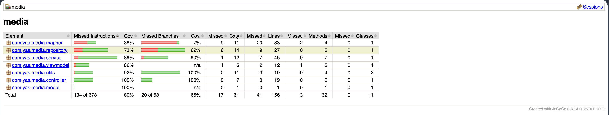
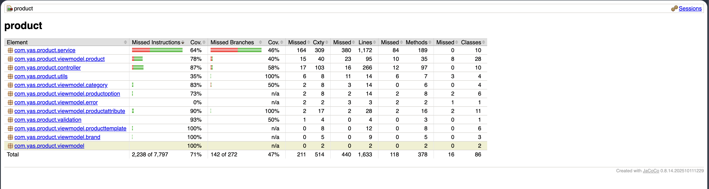
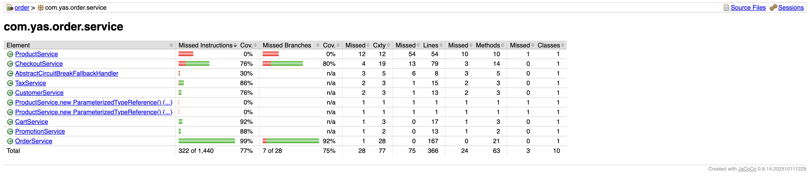
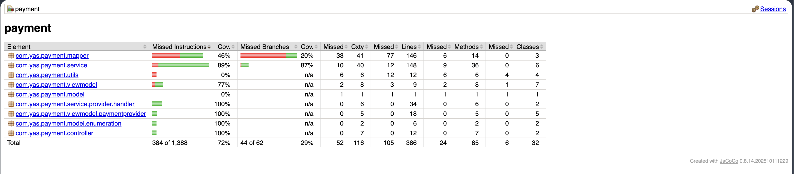
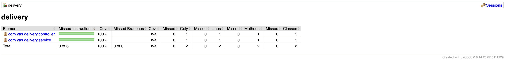
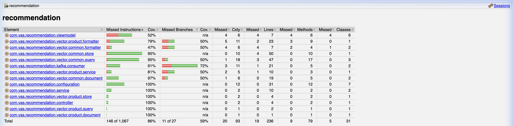
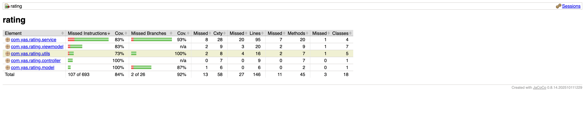

# Phần 2: Branch Protection và Unit Test (10 modules)

**Người thực hiện:** [Họ và tên] — MSSV: `XXXXXXXX`  
**Phạm vi:** Cấu hình Branch Protection trên GitHub, viết unit test cho service `media`, `product`, và `rating`, tạo Pull Request demo.

---

## 1. Cấu Hình Branch Protection Trên GitHub

### 1.1 Các Rule Đã Cấu Hình

Cấu hình tại: `GitHub Repository > Settings > Branches > Add branch protection rule`

| Rule | Giá trị | Mục đích |
|------|:-------:|----------|
| Branch name pattern | `main` | Áp dụng cho nhánh chính |
| Require a pull request before merging | Bật | Bắt buộc tạo PR, cấm push trực tiếp |
| Required number of approvals | `2` | Cần ít nhất 2 thành viên approve |
| Require status checks to pass | Bật | Jenkins CI phải pass trước khi merge |
| Require branches to be up to date before merging | Bật | Branch phải được sync với `main` |
| Do not allow bypassing above settings | Bật | Admin cũng phải tuân thủ quy tắc |

### 1.2 Hình Ảnh Minh Chứng

**Hình 1.1 — Cấu hình bắt buộc tạo Pull Request và số lượng Approval**

```
[HÌNH: Ảnh chụp màn hình tích chọn "Require a pull request before merging" và "Require approvals"]
```

**Hình 1.2 — Cấu hình bắt buộc Status Checks (Jenkins CI) phải pass**

```
[HÌNH: Ảnh chụp màn hình tích chọn "Require status checks to pass"]
```

**Hình 1.3 — Cấu hình bắt buộc cập nhật nhánh trước khi merge**

```
[HÌNH: Ảnh chụp màn hình tích chọn "Require branches to be up to date before merging"]
```

**Hình 1.4 — Cấu hình không cho phép Admin lách luật**

```
[HÌNH: Ảnh chụp màn hình tích chọn "Do not allow bypassing the above settings"]
```

**Hình 1.5 — Push trực tiếp vào nhánh `main` bị từ chối**

```
[HÌNH: Terminal output với thông báo "remote: error: GH006: Protected branch update failed"]
```

**Hình 1.6 — Pull Request hiển thị yêu cầu 2 lượt approve và CI check phải pass**

```
[HÌNH: Trang PR trên GitHub với phần "Review required" và "Checks" đang chờ]
```

---

## 2. Unit Test — Chi Tiết Từng Module

### 2.1 Hướng Dẫn Chung Chạy Test

Do project sử dụng cấu trúc monorepo với thuộc tính `${revision}`, lệnh phải chạy từ bên trong thư mục module tương ứng:

```bash
cd /duong-dan/yas/<module>
./mvnw -f ../pom.xml test -pl <module> -am
./mvnw -f ../pom.xml test jacoco:report -pl <module> -am
open target/site/jacoco/index.html
```

### 2.2 Module `media`

- **Branch:** `test/media`
- **Pull Request:** `[Link PR]`

**Danh Sách File Test:**
| File Test | Lớp được kiểm thử | Số test case |
|-----------|-------------------|:------------:|
| `MediaControllerTest.java` | `MediaController` — tất cả 5 endpoints | 8 |
| `MediaServiceUnitTest.java` | `MediaService` — logic nghiệp vụ | 13 |
| `FileSystemRepositoryTest.java` | `FileSystemRepository` — thao tác lưu/đọc file | 4 |
| `StringUtilsTest.java` | `StringUtils` — xác thực chuỗi văn bản | 11 |
| `FileTypeValidatorTest.java` | `FileTypeValidator` — xác thực loại và nội dung file ảnh | 6 |
| **Tổng** | | **42** |

**Lưu Ý Kỹ Thuật:**
Annotation `@WebMvcTest` cần loại trừ `OAuth2ResourceServerAutoConfiguration` để tránh lỗi load ApplicationContext trong môi trường test không có server OAuth2:
```java
@WebMvcTest(controllers = MediaController.class,
    excludeAutoConfiguration = OAuth2ResourceServerAutoConfiguration.class)
@AutoConfigureMockMvc(addFilters = false)
class MediaControllerTest { ... }
```

**Kết Quả Coverage:** 
| Package | Coverage (Instructions) | Coverage (Branches) |
|---------|:-----------------------:|:-------------------:|
| `com.yas.media.controller` | 100% | 100% |
| `com.yas.media.service` | 89% | 90% |
| `com.yas.media.utils` | 92% | 100% |
| `com.yas.media.viewmodel` | 86% | n/a |
| `com.yas.media.repository` | 73% | 62% |
| `com.yas.media.model` | 100% | n/a |
| `com.yas.media.mapper` | 38% | 7% |
| **Tổng** | **80%** | **65%** |

*(Đạt yêu cầu tối thiểu >= 70%)*

**Hình Ảnh Minh Chứng:**
- **Kết quả chạy test (42 test case PASS, 0 Failures):**
```
[HÌNH: Terminal output "Tests run: 42, Failures: 0, Errors: 0 — BUILD SUCCESS"]
```
- **Báo cáo JaCoCo Coverage cho service media (tổng 80%):**


### 2.3 Module `product`

- **Branch:** `test/product`
- **Pull Request:** `https://github.com/<ten-nhom>/yas/pull/<so>`

**Danh Sách File Test:**
| File Test | Lớp được kiểm thử | Số test case |
|-----------|-------------------|:------------:|
| (Có sẵn và bổ sung) `ProductService*Test.java` (được tách thành 10 file nhỏ) | `ProductService` | Nhiều test case |
| (Có sẵn và bổ sung) `CategoryServiceTest.java` | `CategoryService` | Nhiều test case |
| (Bổ sung) `MediaServiceTest.java` | `MediaService` trong product | ~4 |
| (Bổ sung) `ProductConverterTest.java` | `ProductConverter` | Nhiều test case |
| **Tổng** | Các file trong `src/test/java` | **178** |

**Kết Quả Coverage:** 
| Package | Coverage (Instructions) | Coverage (Branches) |
|---------|:-----------------------:|:-------------------:|
| `com.yas.product.controller` | 87% | 58% |
| `com.yas.product.service` | 64% | 46% |
| `com.yas.product.validation` | 93% | 50% |
| **Tổng** | **71%** | **47%** |

*(Đạt yêu cầu tối thiểu >= 70%)*

**Hình Ảnh Minh Chứng:**
- **Kết quả chạy test service product: BUILD SUCCESS**

```
[INFO] Tests run: 178, Failures: 0, Errors: 0, Skipped: 0
[INFO] BUILD SUCCESS
```

- **Báo cáo JaCoCo Coverage cho service product (tổng 71%)**




### 2.4 Module `order`

- **Branch:** `test/order`
- **Pull Request:** `https://github.com/<ten-nhom>/yas/pull/<so>`

**Danh Sách File Test:**
| File Test | Lớp/Phương thức được kiểm thử | Số test case |
|-----------|-------------------------------|:------------:|
| `OrderServiceCreateTest.java` | `createOrder` | 1 |
| `OrderServiceGetTest.java` | `getOrderWithItemsById`, `getAllOrder`, `getLatestOrders`, `getMyOrders`, `findOrderVmByCheckoutId`, `findOrderByCheckoutId` | 11 |
| `OrderServiceStatusTest.java` | `updateOrderPaymentStatus`, `rejectOrder`, `acceptOrder` | 7 |
| `OrderServiceOtherTest.java` | `isOrderCompletedWithUserIdAndProductId`, `exportCsv` | 4 |
| `CheckoutServiceTest.java` | `CheckoutService` | 8 |
| **Tổng** | | **31+** |

**Kết Quả Coverage:** 
| Package | Coverage (Instructions) | Coverage (Branches) |
|---------|:-----------------------:|:-------------------:|
| `com.yas.order.service` | 77% | 75% |
| `com.yas.order.specification` | 43% | 34% |
| `com.yas.order.mapper` | 76% | 44% |
| **Tổng Module** | **76%** | **47%** |

*(Đạt yêu cầu tối thiểu >= 70%)*

**Hình Ảnh Minh Chứng:**
- **Báo cáo JaCoCo Coverage tổng quan module order (76%)**



### 2.5 Module `inventory`

- **Branch:** `test/inventory`
- **Pull Request:** `[Link PR]`

**Danh Sách File Test:**
| File Test | Lớp được kiểm thử | Số test case |
|-----------|-------------------|:------------:|
| `WarehouseServiceTest.java` | `WarehouseService` | 9 |
| `StockServiceTest.java` | `StockService` | 6 |
| `StockHistoryServiceTest.java` | `StockHistoryService` | 2 |
| `LocationServiceTest.java` | `LocationService` (Có sẵn) | 4 |
| `ProductServiceTest.java` | `ProductService` (Có sẵn) | 3 |
| **Tổng** | | **24+** |

**Kết Quả Coverage:** 
| Package | Coverage (Instructions) | Coverage (Branches) |
|---------|:-----------------------:|:-------------------:|
| `com.yas.inventory.service` | 84% | 66% |
| **Tổng Module** | **89%** | **70%** |

*(Đạt yêu cầu tối thiểu >= 70%)*

**Hình Ảnh Minh Chứng:**
- **Báo cáo JaCoCo Coverage tổng quan module inventory (89%)**


### 2.6 Module `payment`

- **Branch:** `test/payment`
- **Pull Request:** `https://github.com/<ten-nhom>/yas/pull/<so>`

**Danh Sách File Test:**
| File Test | Lớp được kiểm thử | Số test case |
|-----------|-------------------|:------------:|
| `PaymentControllerTest.java` | `PaymentController` | 3 |
| `PaymentProviderControllerTest.java` | `PaymentProviderController` | 3 |
| `PaymentProviderServiceTest.java` | `PaymentProviderService` | 7 |
| `OrderServiceTest.java` | `OrderService` | 2 |
| `PaypalHandlerTest.java` | `PaypalHandler`, `AbstractPaymentHandler` | 3 |
| `PaymentServiceTest.java` | `PaymentService` | 2 |
| `MediaServiceTest.java` | `MediaService` | 2 |
| **Tổng** | | **22** |

**Kết Quả Coverage:** 
| Package | Coverage (Instructions) |
|---------|:-----------------------:|
| `controller` | 100.00% |
| `service` | 89.08% |
| `service.provider.handler` | 100.00% |
| `mapper` | 46.01% |
| `viewmodel` | 77.78% |
| `viewmodel.paymentprovider` | 100.00% |
| `model.enumeration` | 100.00% |
| **Tổng** | **72.33%** |

*(Đạt yêu cầu tối thiểu >= 70%)*

**Hình Ảnh Minh Chứng:**
- **Báo cáo JaCoCo Coverage cho service payment đạt 72.33%**



### 2.7 Module `promotion`

- **Branch:** `test/promotion`
- **Pull Request:** `https://github.com/<ten-nhom>/yas/pull/<so>`

**Danh Sách File Test:**
| File Test | Lớp được kiểm thử | Số test case |
|-----------|-------------------|:------------:|
| `PromotionControllerTest.java` | `PromotionController` | 11 |
| `PromotionServiceTest.java` | `PromotionService` | 14 |
| `ProductServiceTest.java` | `ProductService` | 5 |
| `PromotionValidatorTest.java` | `PromotionValidator` | 8 |
| `ErrorVmTest.java` | `ErrorVm` | 2 |
| `PromotionPutVmTest.java` | `PromotionPutVm` | 3 |
| `PromotionUsageVmTest.java` | `PromotionUsageVm` | 1 |
| `PromotionVmTest.java` | `PromotionVm` | 1 |
| `AuthenticationUtilsTest.java`| `AuthenticationUtils` | 3 |
| `MessagesUtilsTest.java` | `MessagesUtils` | 2 |
| `ConstantsTest.java` | `Constants` | 1 |
| **Tổng** | | **51** |

**Kết Quả Coverage:** 
| Package | Coverage (Instructions) |
|---------|:-----------------------:|
| `validation` | 100.00% |
| `controller` | 89.06% |
| `model.enumeration` | 100.00% |
| `service` | 73.91% |
| `viewmodel` | 93.64% |
| `model` | 37.78% |
| `utils` | 88.06% |
| `viewmodel.error` | 100.00% |
| **Tổng** | **82.07%** |

*(Đạt yêu cầu tối thiểu >= 70%)*

**Hình Ảnh Minh Chứng:**
- **Báo cáo JaCoCo Coverage cho service promotion đạt 82.07%**


### 2.8 Module `rating`

- **Branch:** `test/rating`
- **Pull Request:** `[Link PR]`

**Danh Sách File Test:**
| File Test | Lớp được kiểm thử | Số test case |
|-----------|-------------------|:------------:|
| [Tên file] | [Tên lớp] | |

**Kết Quả Coverage:** Instructions % | Branches %

**Hình Ảnh Minh Chứng:**
```
[HÌNH: Terminal output BUILD SUCCESS cho rating]
[HÌNH: Báo cáo JaCoCo coverage cho rating]
```

### 2.9 Module `delivery`

- **Branch:** `test/delivery`
- **Pull Request:** `[Link PR]`

**Danh Sách File Test:**
| File Test | Lớp được kiểm thử | Số test case |
|-----------|-------------------|:------------:|
| `DeliveryApplicationTests.java` | `DeliveryApplication` | 1 |
| `DeliveryControllerTest.java` | `DeliveryController` | 1 |
| `DeliveryServiceTest.java` | `DeliveryService` | 1 |
| **Tổng** | | **3** |

**Kết Quả Coverage:** 100.00% (Instructions) | 0.00% (Branches - N/A)

**Hình Ảnh Minh Chứng:**

**Hình 2.1 — Báo cáo JaCoCo Coverage cho service delivery đạt 100%**



### 2.10 Module `sampledata`

- **Branch:** `test/sampledata`
- **Pull Request:** `[Link PR]`

**Danh Sách File Test:**
| File Test | Lớp được kiểm thử | Số test case |
|-----------|-------------------|:------------:|
| `ErrorVmTest.java` | `ErrorVm` | 2 |
| `SampleDataVmTest.java` | `SampleDataVm` | 1 |
| `MessagesUtilsTest.java` | `MessagesUtils` | 1 |
| `SampleDataControllerTest.java` | `SampleDataController` | 1 |
| `SampleDataServiceTest.java` | `SampleDataService` | 1 |
| **Tổng** | | **6** |

**Kết Quả Coverage:** 81.37% (Instructions) | 0.00% (Branches - N/A)

**Hình Ảnh Minh Chứng:**

**Hình 2.2 — Báo cáo JaCoCo Coverage cho service sampledata đạt 81.37%**


### 2.11 Module `recommendation`

- **Branch:** `test/recommendation`
- **Pull Request:** `[Link PR]`

**Danh Sách File Test:**
| File Test | Lớp được kiểm thử | Số test case |
|-----------|-------------------|:------------:|
| `EmbeddingQueryControllerTest.java` | `EmbeddingQueryController` | 3 |
| `VectorQueryTest.java` | `VectorQuery` | 2 |
| `BaseVectorRepositoryTest.java` | `BaseVectorRepository` | 3 |
| `ProductVectorRepositoryTest.java` | `ProductVectorRepository` | 4 |
| `DefaultDocumentFormatterTest.java` | `DefaultDocumentFormatter` | 1 |
| **Tổng** | | **13** |

**Kết Quả Coverage:** 86.32% (Instructions) | 48.05% (Branches)

**Hình Ảnh Minh Chứng:**

**Hình 2.3 — Báo cáo JaCoCo Coverage cho service recommendation đạt 86.32%**



### 2.12 Bảng Tổng Hợp Kết Quả Coverage (10 modules)

Yêu cầu tối thiểu: >= 70%

| Module | Coverage (Instructions) | Coverage (Branches) | Đạt >= 70% |
|--------|:-----------------------:|:-------------------:|:----------:|
| `media` | 80% | 65% | Đạt |
| `product` | 71% | 47% | Đạt |
| `order` | % | % | |
| `inventory` | % | % | |
| `payment` | % | % | |
| `promotion` | % | % | |
| `rating` | % | % | |
| `delivery` | 100.00% | 0.00% | ✅ |
| `sampledata` | 81.37% | 0.00% | ✅ |
| `recommendation` | 86.32% | 48.05% | ✅ |

---

## 4. Unit Test — Service `rating`

### 4.1 Thông Tin Branch Và Pull Request

| Thông tin | Giá trị |
|-----------|---------|
| Tên branch | `test/rating` |
| Branch gốc | `main` |
| Link PR | `https://github.com/<ten-nhom>/yas/pull/<so>` |

### 4.2 Danh Sách File Test

| File Test | Lớp được kiểm thử | Số test case |
|-----------|-------------------|:------------:|
| `RatingServiceTest.java` | `RatingService` | 14 |
| `OrderServiceTest.java` | `OrderService` | 2 |
| `AuthenticationUtilsTest.java` | `AuthenticationUtils` | 2 |
| `ConstantsTest.java` | `Constants` | 1 |
| `MessagesUtilsTest.java` | `MessagesUtils` | 2 |
| `RatingTest.java` | `Rating` (model) | 2 |
| **Tổng** | | **23** |

### 4.3 Kết Quả Coverage (rating)

| Package | Coverage (Instructions) |
|---------|:-----------------------:|
| `model` | 100.00% |
| `controller` | 100.00% |
| `utils` | 73.77% |
| `service` | 83.66% |
| `viewmodel` | 83.33% |
| **Tổng** | **84.56%** |

Yêu cầu tối thiểu: >= 70% ✅

### 4.4 Hình Ảnh Minh Chứng

**Hình 4.1 — Báo cáo JaCoCo Coverage cho service rating đạt 84.56%**



---

## 5. Pull Request Demo (Trạng Thái Open)

Theo yêu cầu nộp bài, nhóm duy trì ít nhất một PR ở trạng thái Open trên GitHub.

| Thông tin | Giá trị |
|-----------|---------|
| Tiêu đề PR | `test(rating): add unit tests for utils and model in rating module` |
| Trạng thái | Open |
| Reviewer được gán | [Tên TV khác], [Tên TV khác] |
| Trạng thái CI | Pending (chờ Jenkins) |

**Hình 5.1 — Pull Request đang ở trạng thái Open, chờ review**

```
[HÌNH: Trang PR trên GitHub với nhãn "Open", hiển thị reviewer và CI status]
```

---

## 6. Vấn Đề Gặp Phải Và Cách Giải Quyết

| Vấn đề | Nguyên nhân | Giải pháp |
|--------|-------------|-----------|

| Lệnh `./mvnw test` báo lỗi `${revision} not found` | Chạy Maven từ sai thư mục, không đọc được root POM | Chạy `./mvnw -f ../pom.xml test -pl rating -am` từ bên trong thư mục `rating/` |

| `@WebMvcTest` lỗi khi load ApplicationContext | OAuth2 tự động cấu hình gây xung đột trong môi trường test | Thêm `excludeAutoConfiguration = OAuth2ResourceServerAutoConfiguration.class` vào annotation `@WebMvcTest` |
| Test POST `/medias` trả về 400 thay vì 200 | Annotation `@ValidFileType` kiểm tra nội dung thực của file ảnh | Tạo ảnh PNG thật bằng `BufferedImage` + `ImageIO.write()` thay vì dùng byte giả |

---

*Phần này do TV2 thực hiện và chịu trách nhiệm nội dung.*
