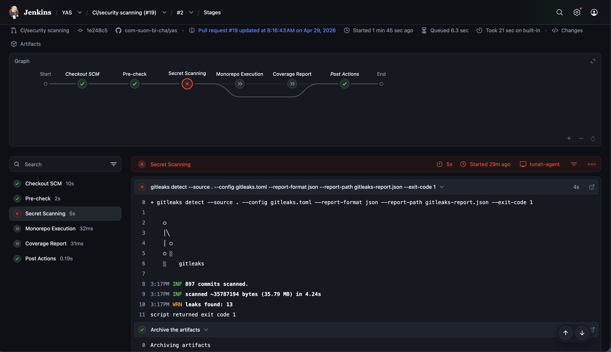
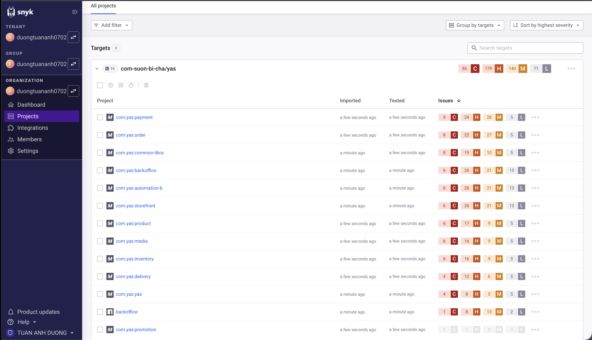
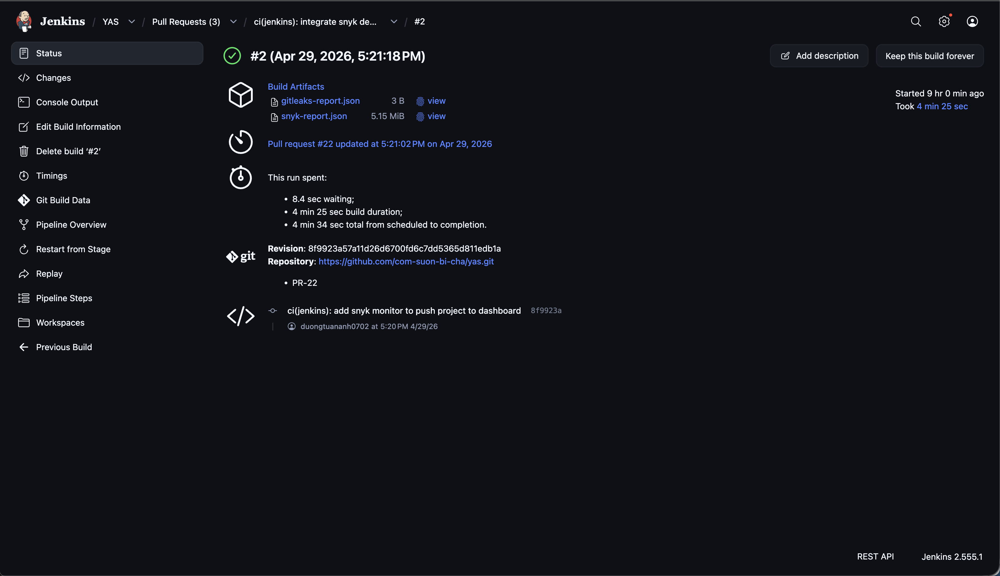
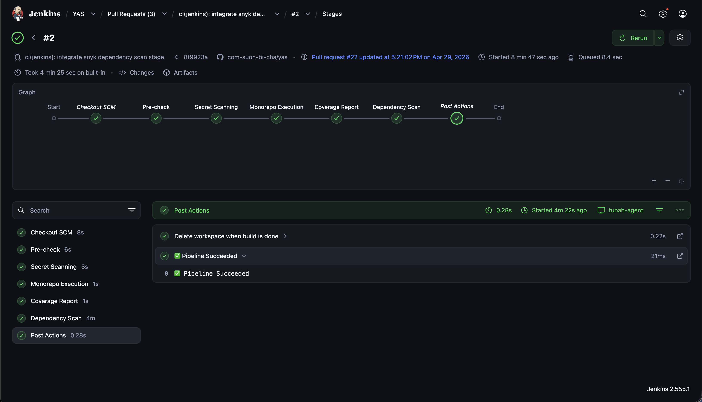

# Phần 3: Security Scanning

**Người thực hiện:** [Họ và tên] — MSSV: `XXXXXXXX`  
**Phạm vi:** Tích hợp Gitleaks, SonarQube, Snyk vào Jenkins pipeline.

---

## 1. Tích Hợp Gitleaks — Quét Secret Bị Lộ

### 1.1 Mô Tả

Gitleaks là công cụ quét mã nguồn để phát hiện các thông tin nhạy cảm bị commit nhầm vào repository, bao gồm API key, mật khẩu, token truy cập và các credential khác.

### 1.2 Cấu Hình Stage Trong Jenkinsfile

```groovy
stage('Secret Scanning') {
    steps {
        sh '''
            gitleaks detect --source . \
                --config gitleaks.toml \
                --report-format json \
                --report-path gitleaks-report.json \
                --exit-code 1
        '''
    }
    post {
        always {
            archiveArtifacts artifacts: 'gitleaks-report.json',
                             allowEmptyArchive: true
        }
    }
}
```

> Pipeline sẽ dừng lại (FAIL) ngay tại stage này nếu Gitleaks phát hiện secret bị lộ.

### 1.3 Xử Lý False Positive

Sau lần chạy đầu tiên, Gitleaks phát hiện **13 findings** trong lịch sử commit — tất cả đều là Keycloak client secret từ **upstream repository** (nashtech-garage/yas), không phải secret thật của nhóm. Các giá trị này là credential cố định dùng cho môi trường dev/demo.

Xử lý bằng cách thêm `commits` vào `allowlist` trong `gitleaks.toml`:

```toml
[allowlist]
description = "global allow list"
paths = [
  '''test-realm.json''',
  '''realm-export''',
  '''keycloak-yas-realm-import.yaml''',
  '''target'''
]
# False positives from upstream YAS repository (dev/demo Keycloak credentials, not real secrets)
commits = [
  "af2c9421030761ec4eccb0994a6c576592be113b",
  "8dc5e08456e8fa8c970b7b0cadcffdcd15d77e39",
  "f3d6c4a83259ca06fc9bc1889b9369d11b423256",
  "2192b03da8ca22e188ecf17f693fb9fbe9376811",
  "b2294a232aa1eea10b9814cf6ece03c5871b98d7",
  "e8fb3139974eb1a27b224416742c6902300ffee3",
  "0cac9558db4e4aa004d72e47e652384d6f32a666",
  "14f0528e9d235c13db92db3bf5e9f3b1cf5b1a7e"
]
```

Sử dụng `commits` allowlist thay vì `paths` để đảm bảo chính xác — chỉ bỏ qua đúng các commit từ upstream, không bỏ qua các secret thật có thể xuất hiện trong tương lai tại cùng file đó.

### 1.4 Hình Ảnh Minh Chứng

**Hình 1.1 — Stage Secret Scanning chạy thành công (không phát hiện secret)**


**Hình 1.2 — Pipeline thất bại khi Gitleaks phát hiện secret**



---

## 2. Tích Hợp SonarQube — Phân Tích Chất Lượng Code

### 2.1 Cài Đặt SonarQube Server

| Thông số | Giá trị |
|----------|---------|
| Phương thức triển khai | Docker (TV1 deploy trên Jenkins server) |
| Phiên bản SonarQube | `v26.4.0.121862` (Community Build) |
| Địa chỉ truy cập | `http://18.140.115.86:9000` |
| Project Key | `yas` |

### 2.2 Kết Nối Jenkins Với SonarQube

Các bước cấu hình:
1. Cài plugin **SonarQube Scanner** trên Jenkins: `Manage Jenkins > Plugins > Available plugins`
2. Tạo token trên SonarQube: `My Account > Security > Generate Tokens` → tên `jenkins-token`
3. Lưu token vào Jenkins Credentials: `Manage Jenkins > Credentials > Global > Add Credentials`
   - Kind: `Secret text`, ID: `sonarqube-token`
4. Thêm SonarQube server: `Manage Jenkins > System > SonarQube servers`
   - Name: `SonarQube`
   - Server URL: `http://18.140.115.86:9000`
   - Token: chọn `sonarqube-token`
5. Tạo webhook từ SonarQube về Jenkins: `Administration > Configuration > Webhooks`
   - Name: `jenkins`, URL: `${JENKINS_URL}/sonarqube-webhook/` (ví dụ: `https://jenkins.example.com/sonarqube-webhook/`)

### 2.3 Cấu Hình Stage Trong Jenkinsfile

```groovy
stage('Code Quality') {
    steps {
        withSonarQubeEnv('SonarQube') {
            sh 'mvn sonar:sonar -Dsonar.projectKey=yas -Dsonar.java.binaries=.'
        }
    }
}
stage('Quality Gate') {
    steps {
        timeout(time: 5, unit: 'MINUTES') {
            waitForQualityGate abortPipeline: true
        }
    }
}
```

> `-Dsonar.java.binaries=.` chỉ định nơi SonarQube tìm **bytecode `.class` đã được compile sẵn`** trong workspace; tham số này **không tự build/compile thêm**. Với monorepo mà pipeline chỉ build một số module, cần bảo đảm các module Java cần phân tích đã được compile trước khi chạy `sonar:sonar`, hoặc giới hạn phạm vi phân tích vào đúng các module đã build.

### 2.4 Kết Quả Phân Tích

SonarQube phân tích toàn bộ monorepo `yas` với **21k Lines of Code** (Java, XML). Kết quả Quality Gate: **Passed**.

| Chỉ số | Kết quả |
|--------|---------|
| Security | 0 issues |
| Reliability | 45 issues |
| Maintainability | 152 issues |
| Coverage | 0.0% |
| Duplications | 3.5% |

### 2.5 Hình Ảnh Minh Chứng

**Hình 2.1 — SonarQube Dashboard: project `yas` với Quality Gate Passed**


**Hình 2.2 — Jenkins pipeline: stage Code Quality (29s) và Quality Gate (23s) chạy thành công**


**Hình 2.3 — Jenkins build summary: pipeline hoàn thành thành công**


---

## 3. Tích Hợp Snyk — Quét Lỗ Hổng Dependency

### 3.1 Cài Đặt Và Cấu Hình

| Thông số | Giá trị |
|----------|---------|
| Tài khoản Snyk | `https://app.snyk.io` |
| Phương thức xác thực | API Token (lưu trong Jenkins Credentials với ID `snyk-token`) |
| Phương thức tích hợp | Snyk CLI (`snyk test` + `snyk monitor`) |

Các bước cấu hình:
1. Đăng ký tài khoản tại `https://app.snyk.io`
2. Vào `Account Settings > Auth Token` → copy token
3. Thêm vào Jenkins: `Manage Jenkins > Credentials > Global > Add Credentials` (Kind: `Secret text`, ID: `snyk-token`)
4. TV1 cài Snyk CLI trên Jenkins agent: `npm install -g snyk`

### 3.2 Cấu Hình Stage Trong Jenkinsfile

```groovy
stage('Dependency Scan') {
    steps {
        withCredentials([string(credentialsId: 'snyk-token', variable: 'SNYK_TOKEN')]) {
            sh 'snyk auth $SNYK_TOKEN'
            sh 'snyk test --all-projects --json > snyk-report.json || true'
            sh 'snyk monitor --all-projects || true'
        }
    }
    post {
        always {
            archiveArtifacts artifacts: 'snyk-report.json',
                             allowEmptyArchive: true
        }
    }
}
```

> `snyk test` quét và báo cáo vulnerability ra console/file. `snyk monitor` đẩy kết quả lên Snyk dashboard để theo dõi liên tục. Cả hai dùng `|| true` để pipeline không FAIL khi phát hiện vulnerability mức thấp.

### 3.3 Kết Quả Quét

Snyk phát hiện vulnerability trong toàn bộ monorepo `com-suon-bi-cha/yas` với tổng cộng **55 Critical, 179 High, 140 Medium, 71 Low** trên tất cả các module. Đây là các lỗ hổng trong dependency (thư viện bên thứ ba) mà các service đang sử dụng.

### 3.4 Hình Ảnh Minh Chứng

**Hình 3.1 — Snyk Dashboard: danh sách project và vulnerability được phát hiện**



**Hình 3.2 — Stage Dependency Scan trong Jenkins pipeline chạy thành công**



---

## 4. Tổng Hợp Pipeline Sau Khi Tích Hợp Security Stages

Pipeline hoàn chỉnh bao gồm các stage theo thứ tự:

```
Pre-check → Secret Scanning → Monorepo Execution → Coverage Report → Dependency Scan
```

**Hình 4.1 — Toàn bộ pipeline chạy thành công với stage Dependency Scan**



---

## 5. Vấn Đề Gặp Phải Và Cách Giải Quyết

| Vấn đề | Nguyên nhân | Giải pháp |
|--------|-------------|-----------|
| `gitleaks: command not found` tại Pre-check | Gitleaks chưa được cài trên Jenkins agent | Phối hợp TV1 cài `brew install gitleaks` trên agent |
| Gitleaks phát hiện 13 findings, pipeline FAIL | Keycloak client secret từ upstream repo bị nhận nhầm là secret thật | Thêm `commits` allowlist vào `gitleaks.toml` cho 8 commit từ upstream |
| Snyk chạy xong nhưng không thấy project trên dashboard | `snyk test` chỉ quét local, không đẩy lên dashboard | Thêm `snyk monitor` vào stage để đăng ký project lên Snyk dashboard |

---

*Phần này do TV3 thực hiện và chịu trách nhiệm nội dung.*
