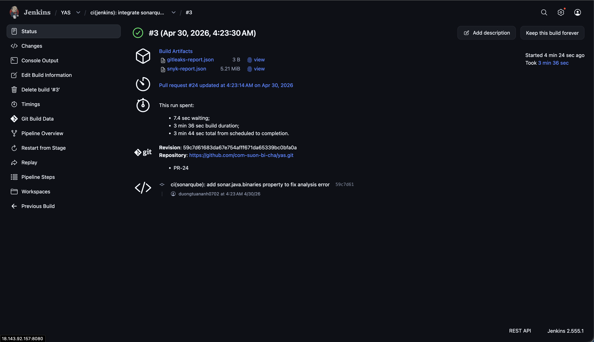

# Phần 3: Security Scanning

**Người thực hiện:** [Họ và tên] — MSSV: `XXXXXXXX`  
**Phạm vi:** Tích hợp Gitleaks, SonarQube, Snyk vào Jenkins pipeline.

---

## 1. Tích Hợp Gitleaks — Quét Secret Bị Lộ

### 1.1 Mô Tả

Gitleaks là công cụ quét mã nguồn để phát hiện các thông tin nhạy cảm bị commit nhầm vào repository, bao gồm API key, mật khẩu, token truy cập và các credential khác.

### 1.2 Cấu Hình Stage Trong Jenkinsfile

```groovy
stage('Secret Scanning') {
    steps {
        sh '''
            gitleaks detect --source . \
                --report-format json \
                --report-path gitleaks-report.json \
                --exit-code 1
        '''
    }
    post {
        always {
            archiveArtifacts artifacts: 'gitleaks-report.json', allowEmptyArchive: true
        }
    }
}
```

> Pipeline sẽ dừng lại (FAIL) ngay tại stage này nếu Gitleaks phát hiện secret bị lộ.

### 1.3 Cấu Hình File `.gitleaksignore` (Nếu Có)

> Trong trường hợp phát sinh false positive (cảnh báo nhầm), thêm exception vào file `.gitleaksignore`:

```
[Điền nội dung file .gitleaksignore nếu nhóm có cấu hình]
```

### 1.4 Hình Ảnh Minh Chứng

**Hình 1.1 — Stage Secret Scanning chạy thành công (không phát hiện secret)**

```
[HÌNH: Jenkins Console Output — Gitleaks chạy và kết thúc với trạng thái SUCCESS]
```

**Hình 1.2 — Pipeline thất bại khi Gitleaks phát hiện secret (trường hợp demo)**

```
[HÌNH: Jenkins build FAIL với thông báo Gitleaks tìm thấy secret trong commit]
```

---

## 2. Tích Hợp SonarQube — Phân Tích Chất Lượng Code

### 2.1 Cài Đặt SonarQube Server

| Thông số | Giá trị |
|----------|---------|
| Phương thức triển khai | Docker (TV1 deploy trên Jenkins server) |
| Phiên bản SonarQube | `v26.4.0.121862` (Community Build) |
| Địa chỉ truy cập | `http://18.140.115.86:9000` |
| Project Key | `yas` |

### 2.2 Kết Nối Jenkins Với SonarQube

Các bước cấu hình:
1. Cài plugin **SonarQube Scanner** trên Jenkins: `Manage Jenkins > Plugins > Available plugins`
2. Tạo token trên SonarQube: `My Account > Security > Generate Tokens` → tên `jenkins-token`
3. Lưu token vào Jenkins Credentials: `Manage Jenkins > Credentials > Global > Add Credentials`
   - Kind: `Secret text`, ID: `sonarqube-token`
4. Thêm SonarQube server: `Manage Jenkins > System > SonarQube servers`
   - Name: `SonarQube`
   - Server URL: `http://18.140.115.86:9000`
   - Token: chọn `sonarqube-token`
5. Tạo webhook từ SonarQube về Jenkins: `Administration > Configuration > Webhooks`
   - Name: `jenkins`, URL: `${JENKINS_URL}/sonarqube-webhook/` (ví dụ: `https://jenkins.example.com/sonarqube-webhook/`)

### 2.3 Cấu Hình Stage Trong Jenkinsfile

```groovy
stage('Code Quality') {
    steps {
        withSonarQubeEnv('SonarQube') {
            sh 'mvn sonar:sonar -Dsonar.projectKey=yas -Dsonar.java.binaries=.'
        }
    }
}
stage('Quality Gate') {
    steps {
        timeout(time: 5, unit: 'MINUTES') {
            waitForQualityGate abortPipeline: true
        }
    }
}
```

> `-Dsonar.java.binaries=.` cho phép SonarQube tìm compiled classes ở bất kỳ đâu trong project — cần thiết vì Monorepo Execution chỉ compile các service có thay đổi, không phải toàn bộ project.

### 2.4 Kết Quả Phân Tích

SonarQube phân tích toàn bộ monorepo `yas` với **21k Lines of Code** (Java, XML). Kết quả Quality Gate: **Passed**.

| Chỉ số | Kết quả |
|--------|---------|
| Security | 0 issues |
| Reliability | 45 issues |
| Maintainability | 152 issues |
| Coverage | 0.0% |
| Duplications | 3.5% |

### 2.5 Hình Ảnh Minh Chứng

**Hình 2.1 — SonarQube Dashboard: project `yas` với Quality Gate Passed**


**Hình 2.2 — Jenkins pipeline: stage Code Quality (29s) và Quality Gate (23s) chạy thành công**


**Hình 2.3 — Jenkins build summary: pipeline hoàn thành thành công**



---

## 3. Tích Hợp Snyk — Quét Lỗ Hổng Dependency

### 3.1 Cài Đặt Và Cấu Hình

| Thông số | Giá trị |
|----------|---------|
| Tài khoản Snyk | `https://app.snyk.io` |
| Phương thức xác thực | API Token (lưu trong Jenkins Credentials) |
| Phương thức tích hợp | Snyk CLI |

### 3.2 Cấu Hình Stage Trong Jenkinsfile

```groovy
stage('Dependency Scan') {
    steps {
        withCredentials([string(credentialsId: 'snyk-token', variable: 'SNYK_TOKEN')]) {
            sh 'snyk auth $SNYK_TOKEN'
            sh 'snyk test --all-projects --json > snyk-report.json || true'
        }
    }
    post {
        always {
            archiveArtifacts artifacts: 'snyk-report.json', allowEmptyArchive: true
        }
    }
}
```

> Sử dụng `|| true` để pipeline không dừng lại khi Snyk tìm thấy vulnerability có mức độ thấp. Có thể điều chỉnh ngưỡng với flag `--severity-threshold=high`.

### 3.3 Hình Ảnh Minh Chứng

**Hình 3.1 — Snyk Dashboard: danh sách vulnerability được phát hiện**

```
[HÌNH: https://app.snyk.io > Projects > yas — danh sách các dependency có lỗ hổng]
```

**Hình 3.2 — Stage Dependency Scan trong Jenkins: output kết quả quét**

```
[HÌNH: Jenkins Console Output của lệnh snyk test với kết quả]
```

---

## 4. Tổng Hợp Pipeline Sau Khi Tích Hợp Security Stages

**Hình 4.1 — Toàn bộ pipeline bao gồm các stage quét bảo mật**

```
[HÌNH: Blue Ocean hoặc Stage View thể hiện đầy đủ: Secret Scanning, Code Quality, Quality Gate, Dependency Scan]
```

---

## 5. Vấn Đề Gặp Phải Và Cách Giải Quyết

| Vấn đề | Nguyên nhân | Giải pháp |
|--------|-------------|-----------|
| [Điền vào] | | |

---

*Phần này do TV3 thực hiện và chịu trách nhiệm nội dung.*
